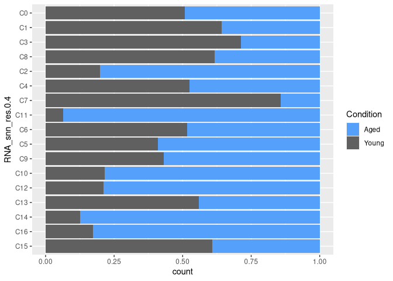
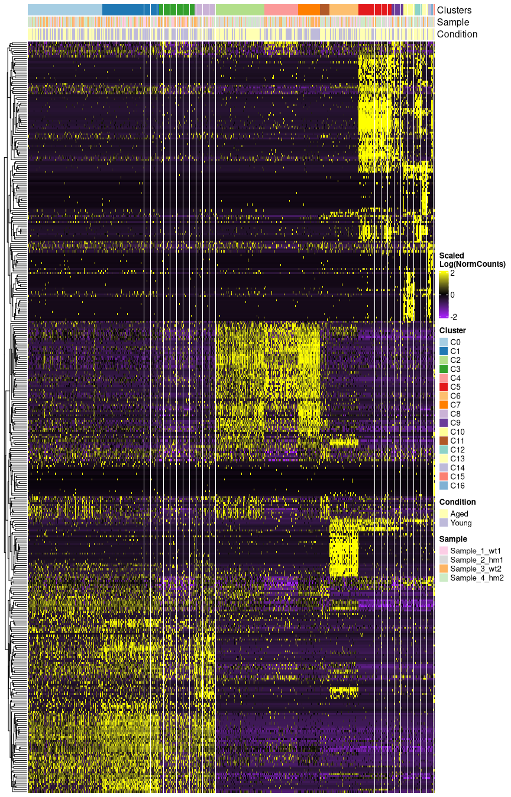
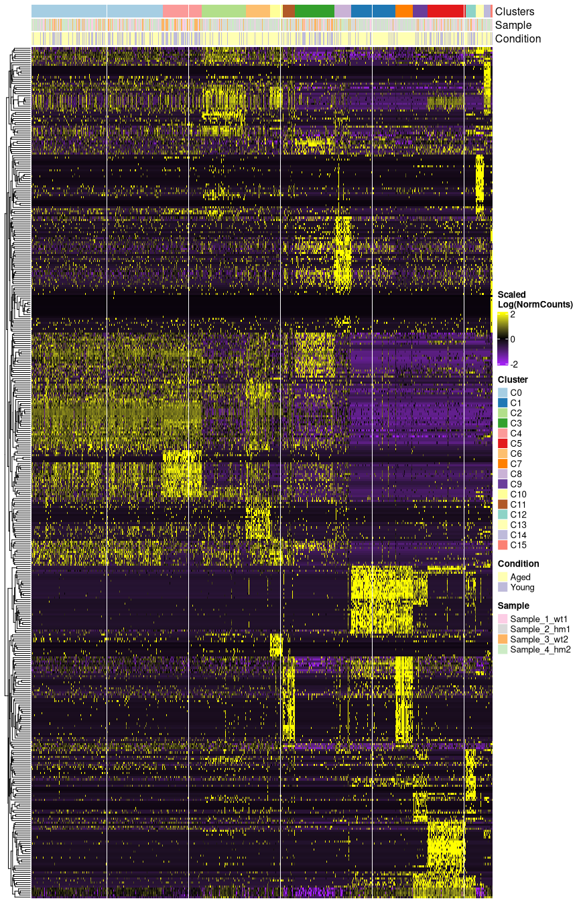
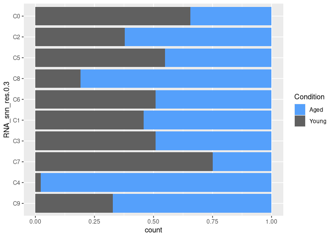
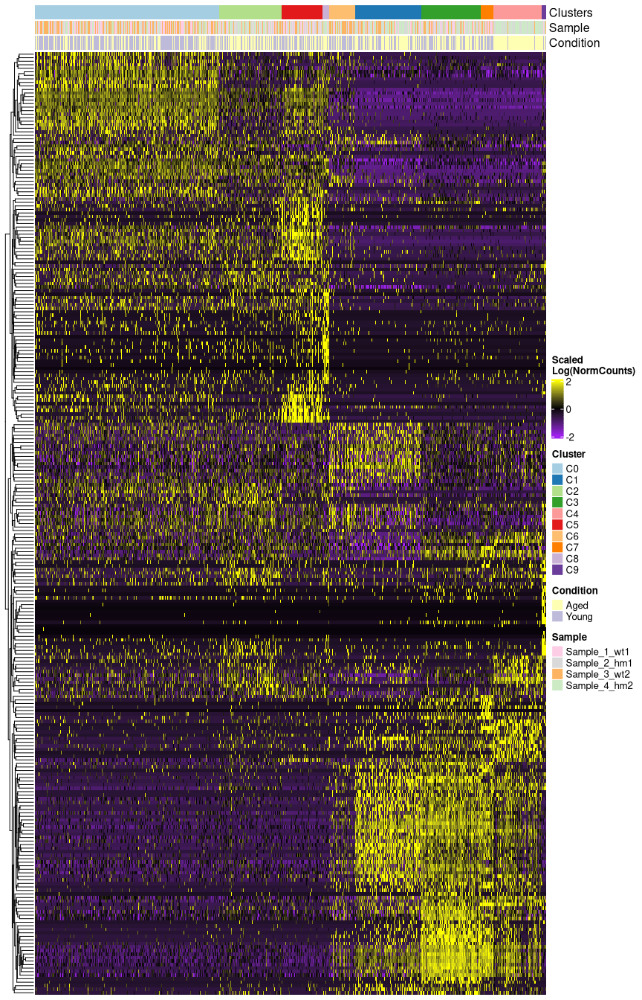
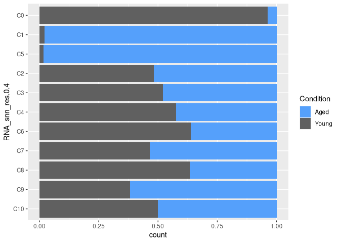
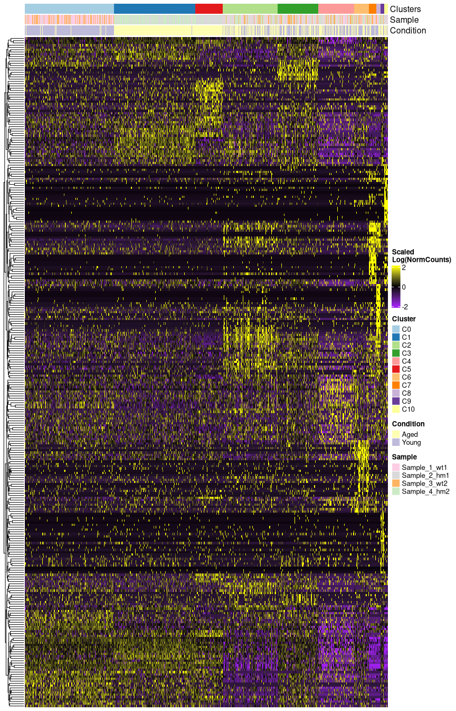

Single Cell Analysis of LmnaG609 and WT mice aortas
================
Ana Barettino, Carlos Torroja, Fátima Sánchez-Cabo, Ignacio Benedicto,
Vicente Andrés

- [1 Experimental Design](#1-experimental-design)
- [2 Data](#2-data)
- [3 SetUp R environment](#3-setup-r-environment)
  - [3.1 Custom Functions](#31-custom-functions)
- [4 Load Sample Metadata](#4-load-sample-metadata)
- [5 Load CellRanger Counts
  Matrices](#5-load-cellranger-counts-matrices)
- [6 Load Genes Metadata](#6-load-genes-metadata)
- [7 Find Doublets](#7-find-doublets)
- [8 QC and Filter Single Cell
  Experiment](#8-qc-and-filter-single-cell-experiment)
- [9 Cluster all cells](#9-cluster-all-cells)
  - [9.1 Cluster Proportions Per
    Condition](#91-cluster-proportions-per-condition)
  - [9.2 Find Markers of clusters](#92-find-markers-of-clusters)
    - [9.2.1 Heatmap and DotPlot](#921-heatmap-and-dotplot)
    - [9.2.2 Functional enrichment of markers for eah
      cluster](#922-functional-enrichment-of-markers-for-eah-cluster)
  - [9.3 Find Differences between conditions for each
    cluster](#93-find-differences-between-conditions-for-each-cluster)
    - [9.3.1 Functional enrichment of DE genes for each
      cluster](#931-functional-enrichment-of-de-genes-for-each-cluster)
- [10 Subset to Hemotopoyectic Cells and
  Recluster](#10-subset-to-hemotopoyectic-cells-and-recluster)
  - [10.1 Find markers for each Hematopoyectic
    cluster](#101-find-markers-for-each-hematopoyectic-cluster)
    - [10.1.1 Heatmap and DotPlot](#1011-heatmap-and-dotplot)
  - [10.2 Functional Enrichment for markers of each
    cluster](#102-functional-enrichment-for-markers-of-each-cluster)
  - [10.3 Find DE genes between conditions for each
    cluster](#103-find-de-genes-between-conditions-for-each-cluster)
    - [10.3.1 Functional Enrichment of DE genes for each
      cluster](#1031-functional-enrichment-of-de-genes-for-each-cluster)
  - [10.4 Trayectory Analysis for Monocyte
    clusters](#104-trayectory-analysis-for-monocyte-clusters)
- [11 Subset to Fibroblasts and SMCs and
  Recluster](#11-subset-to-fibroblasts-and-smcs-and-recluster)
  - [11.1 Cluster Proportions Per
    Condition](#111-cluster-proportions-per-condition)
  - [11.2 Find markers for each Fibroblast/SMC
    cluster](#112-find-markers-for-each-fibroblastsmc-cluster)
    - [11.2.1 Heatmap and DotPlot](#1121-heatmap-and-dotplot)
    - [11.2.2 Functinal Enrichment for markers of each
      cluster](#1122-functinal-enrichment-for-markers-of-each-cluster)
- [12 Find DE genes between conditions for each Fibroblast/SMC
  cluster](#12-find-de-genes-between-conditions-for-each-fibroblastsmc-cluster)
  - [12.0.1 Functional Enrichment of DE genes for each
    cluster](#1201-functional-enrichment-of-de-genes-for-each-cluster)
  - [12.1 Trayectory Analysis for Fibroblast/SMC
    clusters](#121-trayectory-analysis-for-fibroblastsmc-clusters)
- [13 Subset to Endothelial cells and
  rescluster](#13-subset-to-endothelial-cells-and-rescluster)
  - [13.1 Cluster Proportions Per
    Condition](#131-cluster-proportions-per-condition)
  - [13.2 Find markers for each Endothelial
    cluster](#132-find-markers-for-each-endothelial-cluster)
    - [13.2.1 Heatmap and DotPlot](#1321-heatmap-and-dotplot)
    - [13.2.2 Functional Enrichment for markers of each
      cluster](#1322-functional-enrichment-for-markers-of-each-cluster)
  - [13.3 Find DE genes between conditions for each
    cluster](#133-find-de-genes-between-conditions-for-each-cluster)
    - [13.3.1 Functional Enrichment of DE genes for each
      cluster](#1331-functional-enrichment-of-de-genes-for-each-cluster)
- [14 CellPhone Analysis on Endothelial Vs Hemotopoyectic
  Cells](#14-cellphone-analysis-on-endothelial-vs-hemotopoyectic-cells)
  - [14.1 Annotate Cell Types](#141-annotate-cell-types)
  - [14.2 Find DE genes between Endothelial Clusters C0 and
    C1](#142-find-de-genes-between-endothelial-clusters-c0-and-c1)
  - [14.3 Compute CellPhone
    Interactome](#143-compute-cellphone-interactome)
  - [14.4 Load CellPhone Results](#144-load-cellphone-results)
- [15 Filter interactions to pairs with at least one DE gene between EC0
  and
  EC1](#15-filter-interactions-to-pairs-with-at-least-one-de-gene-between-ec0-and-ec1)
  - [15.1 Configure Plot](#151-configure-plot)
- [16 Session Info](#16-session-info)

# 1 Experimental Design

Mice:

Mouse studies were conducted with male and female 14-week-old
LmnaG609G/G609G mice with ubiquitous progerin expression9 (provided by
C. López-Otín, Universidad de Oviedo, Spain) and wild-type Lmna+/+
littermates as controls. Atherosclerosis studies were conducted with
atheroprone progeroid Apoe–/– LmnaG609G/G609G mice$$1$$. Single-cell
RNA-seq:

Aortas (including aortic arch and thoracic aorta) from Lmna+/+ and
LmnaG609G/G609G mice were dissected, cleaned of perivascular fat, and
opened longitudinally. Viable single cell suspensions were obtained
using a previously described protocol with minor modifications$$2$$. We
analyzed two replicate samples per genotype, and each sample contained
pooled cells from the aortas of two male and two female animals to avoid
possible sex-related bias. Cells were 126 loaded onto a Chromium Next
GEM Chip G (10x Genomics), and libraries were created using the Next GEM
Single cell 3’Library preparation kit v3.1 (10x Genomics) and indexed
using the Chromium i7 Multiplex kit (10x Genomics). Libraries were
paired-end sequenced in a HiSeq 4000 system (Illumina), and single cell
transcriptomes were obtained using the 10x Genomics Cell Ranger 3.1.0
pipeline and analyzed with the Scater$$3$$ and Seurat$$4$$ R packages.
We analyzed a total of 34,152 cells after removing predicted doublets
and low-quality cells.

1.- McCarthy DJ, Campbell KR, Lun ATL, Willis QF (2017). “Scater:
pre-processing, quality control, normalisation and visualisation of
single-cell RNA-seq data in R.” Bioinformatics, 33, 1179-1186.
<doi:10.1093/bioinformatics/btw777>
(<https://doi.org/10.1093/bioinformatics/btw777>).

2.- Yuhan Hao and Stephanie Hao and Erica Andersen-Nissen and William M.
Mauck III and Shiwei Zheng and Andrew Butler and Maddie J. Lee and Aaron
J. Wilk and Charlotte Darby and Michael Zagar and Paul Hoffman and
Marlon Stoeckius and Efthymia Papalexi and Eleni P. Mimitou and Jaison
Jain and Avi Srivastava and Tim Stuart and Lamar B. Fleming and Bertrand
Yeung and Angela J. Rogers and Juliana M. McElrath and Catherine A.
Blish and Raphael Gottardo and Peter Smibert and Rahul Satija (2021).
“Integrated analysis of multimodal single-cell data.” Cell, Vo.l. 184,
Issue 13,, title = {Integrated analysis of multimodal single-cell data},
journal = {Cell}, year = {2021}, doi = {10.1016/j.cell.2021.04.048}, url
= {<https://doi.org/10.1016/j.cell.2021.04.048>}, }

# 2 Data

To reproduce the analysis of the related paper you will need to download
from the BioStudies reposotory
[E-MTAB-13678](https://www.ebi.ac.uk/biostudies/arrayexpress/studies/E-MTAB-13678)
the following files:

Samples and Genes Metadata:

sampleMetadata.txt.gz genesMetadata.v84.mar2016.archive.tsv.gz
GeneSetsForScores.xlsx

CellRanger Quantification Files Per Sample:

Sample_1_wt1_barcodes.tsv.gz Sample_1_wt1_features.tsv.gz
Sample_1_wt1_matrix.mtx.gz Sample_2_hm1_barcodes.tsv.gz
Sample_2_hm1_features.tsv.gz Sample_2_hm1_matrix.mtx.gz
Sample_3_wt2_barcodes.tsv.gz Sample_3_wt2_features.tsv.gz
Sample_3_wt2_matrix.mtx.gz Sample_4_hm2_barcodes.tsv.gz
Sample_4_hm2_features.tsv.gz Sample_4_hm2_matrix.mtx.gz

Doublets Prediction Files Per Sample:

Sample_1_wt1.doubletsPredictionList.txt.gz
Sample_2_hm1.doubletsPredictionList.txt.gz
Sample_3_wt2.doubletsPredictionList.txt.gz
Sample_4_hm2.doubletsPredictionList.txt.gz

CellPhone Results Files:

cellphone_deconvoluted.txt.gz cellphone_means.txt.gz
cellphone_pvalues.txt.gz cellphone_significant_means.txt.gz

# 3 SetUp R environment

``` r
library(rstudioapi)
library(Seurat)
library(scater)
library(slingshot)
library(dplyr)
library(biomaRt)
library(enrichR)
library(tidyverse)
library(RColorBrewer)
library(openxlsx)
library(gtools)
library(ComplexHeatmap)
library(circlize)

# Color palete
color.list <- c(brewer.pal(12, "Paired"),brewer.pal(12, "Set3"),brewer.pal(8, "Pastel2"),colorRampPalette(c("grey20","grey70"))(4))
to <- color.list[22]
ss <- color.list[18]
color.list[22] <- ss
color.list[18] <- to
```

## 3.1 Custom Functions

``` r
filterResultsByDEExp <- function (cpResults,cpPvals,cpMetadata,
                                  deGenes = NULL,
                                  regExp = NULL,
                                  maxIntPval = 0.05,
                                  maxDEPval = 0.05) {
  
  # Get interaction pvals for clusters in myRegExp
  cpPvalsF <- cpPvals[,c(seq(11),grep(regExp,colnames(cpPvals)))]
  
  # Filter interactions with a pval < maxIntPval in at least one cluster pair
  cpPvalsF <- cpPvalsF[rowSums(cpPvalsF[,12:ncol(cpPvalsF)]<maxIntPval)>= 1,]
  
  # Get Only the significant cluster pairs
  cpPvalsF <- cpPvalsF[,c(rep(T,11),colSums(cpPvalsF[,12:ncol(cpPvalsF)]<maxIntPval)>= 1)]
  
  # Get Interactions Metadata from those selected
  cpMetadataF <- cpMetadata[cpMetadata$id_cp_interaction %in% cpPvalsF$id_cp_interaction,]
  
  # Get Interaction Scores from those selected
  cpResultsF <- cpResults[cpResults$id_cp_interaction %in% cpPvalsF$id_cp_interaction,]
  
  if (!is.null(deGenes)) {
    
    # Add DE test and Cell Type information to interactions metadata
    cpMetadataFLonger <- cpMetadataF %>%
      pivot_longer(cols = !1:6,
                   names_to = "cluster",values_to = "Exp")
    
    cpMetadataFLonger <- cpMetadataFLonger %>%
      left_join(deGenes %>% dplyr::select(-cluster), by = c("gene_name"="gene"))
    
    # Add gene_name to complex_name column when not complex
    # to group later by complex_name and get the min DEpval of
    # any gene in the complex/gene
    cpMetadataFLonger <- cpMetadataFLonger %>%
      mutate(complex_name = ifelse(
        is_complex == "False",
        gene_name,
        complex_name)
      )
    
    # Get the min DE pval by complex
    cpMetadataFLongerMinDEpval <- cpMetadataFLonger %>%
      group_by(complex_name,cluster) %>%
      summarise(
        across(contains("p_val_adj"), .fns = function (x) {
          p <- 1
          if (!all(is.na(x))) {
            p <- min(x,na.rm = T)
          } 
          return(p)
        }),
        is_complex = unique(is_complex)
      ) %>%
      dplyr::select(cluster,complex_name,is_complex,everything()) %>%
      rename(MinDEAdjPval = "p_val_adj")
    
    cpMetadataFLonger <- cpMetadataFLonger %>%
      left_join(cpMetadataFLongerMinDEpval
                , by = c("cluster","complex_name","is_complex"))
    
    # Filter Complex table to DE genes in Experiment
    # Will give us the interactions with a DE sig partner
    # It includes complexes as they are expanded by their genes
    cpMetadataFLongerF <- cpMetadataFLonger %>%
      filter(MinDEAdjPval < maxDEPval)
    
    # Filter Results to interactions with DE genes in Experiment
    # We may filter it later using the complex DE table instead
    cpResultsF <- cpResultsF %>%
      filter(id_cp_interaction %in% cpMetadataFLongerF$id_cp_interaction)
    
    cpPvalsF <- cpPvalsF %>%
      filter(id_cp_interaction %in% cpMetadataFLongerF$id_cp_interaction)
  }
  
  # Combine scores with pvals
  resultcols <- colnames(cpResultsF)[1:12]
  intcols <- colnames(cpPvalsF)[12:ncol(cpPvalsF)]  
  
  cpResultsF <- cpResultsF %>%
    dplyr::select(all_of(c(resultcols,intcols))) %>%
    pivot_longer(cols = all_of(intcols),
                 names_to = "ClusterPair",
                 values_to = "mean")
  
  cpPvalsF <- cpPvalsF %>%
    pivot_longer(cols = all_of(intcols),names_to="ClusterPair",values_to="pvalue")
  
  cpResultsF <- cpResultsF %>%
    left_join(cpPvalsF)
  
  # Split cluster interaction pair
  cpResultsF <- cpResultsF %>%
    separate(ClusterPair,c("clusterA","clusterB"),sep = "\\|") %>%
    mutate(ClusterPair = paste(clusterA,clusterB,sep="|"))
  
  # Parse partner names to match Complex table node_names
  cpResultsF <- cpResultsF %>%
    separate(partner_a,c("is_complex_a","partner_a"),sep = "\\:",extra = "merge") %>%
    separate(partner_b,c("is_complex_b","partner_b"),sep = "\\:",extra = "merge") %>%
    mutate(is_complex_a=ifelse(is_complex_a=="complex",T,F),is_complex_b=ifelse(is_complex_b=="complex",T,F))
  
  if (!is.null(deGenes)) {
    # Add complex_name to gene_name when is complex
    # To combine it with the complex DE sig table
    cpResultsF <- cpResultsF %>%
      mutate(gene_a = ifelse(is_complex_a,partner_a,gene_a)) %>%
      mutate(gene_b = ifelse(is_complex_b,partner_b,gene_b))
    
    # Combine with the complex DE Significance 
    # partner a and b
    cpResultsF <- 
      cpResultsF %>%
      left_join(cpMetadataFLongerF %>%
                  dplyr::select(id_cp_interaction,
                                cluster,complex_name,
                                Exp,MinDEAdjPval) %>% distinct(),
                by = c("id_cp_interaction",
                       "clusterA"="cluster",
                       "gene_a"="complex_name"),
                suffix=c(".x","_a")) %>%
      rename(MinDEAdjPval_a="MinDEAdjPval")
    
    cpResultsF <- 
      cpResultsF %>%
      left_join(cpMetadataFLongerF %>%
                  dplyr::select(id_cp_interaction,
                                cluster,complex_name,
                                Exp,MinDEAdjPval) %>%
                  distinct(),
                by = c("id_cp_interaction",
                       "clusterB"="cluster",
                       "gene_b"="complex_name"),
                suffix=c("_a","_b")) %>%
      rename(MinDEAdjPval_b="MinDEAdjPval")
    
  }
  
  myList <- list(
    results = cpResultsF,
    pvals = cpPvalsF,
    metadata = cpMetadataF)
  
  if (!is.null(deGenes)) {
    myList$metadataLonger = cpMetadataFLongerF
  }
  return(myList)
}

dotPlotInt <- function (x,title="") {
  p <- x %>%
    ggplot(aes(x=ClusterPair,y=interacting_pair
               ,size=-log10(pvalue+0.0009)
               ,color=m)) +
    geom_point() +
    scale_color_gradientn(colors = rev(RColorBrewer::brewer.pal(11,"Spectral")),name="Log2 mean (Molecule 1, Molecule 2)") +
    ggtitle(title) +
    theme(axis.text.x = element_text(angle = 45,hjust = 1,size = 12),
          axis.text.y = element_text(size = 12),
          panel.background =  element_blank(),
          axis.line = element_line(),
          axis.title.x = element_blank(),
          axis.title.y = element_blank(),
          panel.grid.major = element_line(color = "grey70")
    )
  return(p)
}

dotPlotInt2 <- function (x,title="") {
  p <- x %>%
    ggplot(aes(x=ClusterPair,y=interacting_pair
               ,size=-log10(pvalue+0.0009)
               ,fill=m)) +
    geom_point(shape=21,color="grey60") +
    scale_fill_gradientn(colors = rev(RColorBrewer::brewer.pal(11,"Spectral")),name="Log2 mean (Molecule 1, Molecule 2)") +
    ggtitle(title) +
    theme(axis.text.x = element_text(angle = 45,hjust = 1,size = 12),
          axis.text.y = element_text(size = 12),
          panel.background =  element_blank(),
          axis.line = element_line(),
          axis.title.x = element_blank(),
          axis.title.y = element_blank(),
          panel.grid.major = element_line(color = "grey70")
    )
  return(p)
}
```

# 4 Load Sample Metadata

``` r
sampleMetadataFile <- "sampleMetadata.txt.gz"
sampleMetada <- read.delim(sampleMetadataFile,sep = "\t",header = T)

sampleMetada
```

    ##         Sample Condition Index Genotype Tissue Strain Assay_Type Instrument
    ## 1 Sample_1_wt1     Young   All       WT  Aorta 129_B6      3_UMI        10X
    ## 2 Sample_2_hm1      Aged   All       HM  Aorta 129_B6      3_UMI        10X
    ## 3 Sample_3_wt2     Young   All       WT  Aorta 129_B6      3_UMI        10X
    ## 4 Sample_4_hm2      Aged   All       HM  Aorta 129_B6      3_UMI        10X
    ##   Organism Platform
    ## 1    Mouse ILLUMINA
    ## 2    Mouse ILLUMINA
    ## 3    Mouse ILLUMINA
    ## 4    Mouse ILLUMINA

# 5 Load CellRanger Counts Matrices

``` r
crPathFrom <- "."
crPathTo <- "CellRanger.Quantifications"

cellRangerFiles <- dir(crPathFrom,ignore.case = T,pattern = "^.+(mtx|barcode|feature).+$")
sampleNames <- unique(sub("_(barcodes|matrix|features).+$","",cellRangerFiles,perl = T))

dir.create(crPathTo,showWarnings = F)

dc <- lapply(file.path(crPathTo,sampleNames),dir.create,showWarnings = F, recursive = T)

dc <- lapply(sampleNames, function (x, pathFrom,pathTo) {
  sampleFilesFrom <- dir(pathFrom,pattern = x)
  sampleFilesFrom <- sampleFilesFrom[grepl("^.+(mtx|barcode|feature).+$",sampleFilesFrom)]
  sampleFilesTo <- file.path(crPathTo,x,sub(paste0(x,"_"),"",sampleFilesFrom))
  file.copy(from = file.path(pathFrom,sampleFilesFrom), to = sampleFilesTo,overwrite = T)
},pathFrom=crPathFrom,pathTo=crPathTo)

sampleMetada$FilteredCellRangerCounts <- file.path(crPathTo,sampleMetada$Sample)
```

``` r
smList <- lapply(sampleMetada$FilteredCellRangerCounts,Read10X,gene.column=1)

names(smList) <- sampleMetada$Sample

smList <- lapply(names(smList), function (x,myList) {
  l <- myList[[x]]
  colnames(l) <- paste(colnames(l),x,sep=".")
  return(l)
  },
  myList = smList)

names(smList) <- sampleMetada$Sample

rawCounts <- do.call(cbind,smList)
```

# 6 Load Genes Metadata

``` r
# Get Genes Metadata
genesMetadata <- read_tsv("genesMetadata.v84.mar2016.archive.tsv.gz")
genesMetadata <- genesMetadata %>%
  filter(ensembl_gene_id %in% rownames(rawCounts)) %>%
  mutate(mgi_symbol = ifelse(mgi_symbol == "",external_synonym,mgi_symbol)) %>%
  mutate(mgi_symbol = ifelse(mgi_symbol == "",ensembl_gene_id,mgi_symbol)) %>%
  mutate(uniq_name = make.unique(mgi_symbol))
MTGenes <- genesMetadata[genesMetadata$chromosome_name == "MT",]

RBGenes <- genesMetadata[genesMetadata$gene_biotype == "rRNA",]

SGenes <- genesMetadata[genesMetadata$external_gene_name %in% cc.genes$s.genes,]

G2MGenes <- genesMetadata[genesMetadata$external_gene_name %in% cc.genes$g2m.genes,]

HBBGenes <- genesMetadata[grep("hemoglobin",genesMetadata$description,ignore.case = T),]

ann.IG.TCR <- genesMetadata[grep("^IG_\\w*|^TR_\\w*",genesMetadata$gene_biotype,perl=T,ignore.case = T),]

IGs <- grepl("^IG[HLK]",ann.IG.TCR$external_gene_name, ignore.case = T) & !grepl("IG_C",ann.IG.TCR$gene_biotype)
IGGenes <- ann.IG.TCR[IGs,]  
TRs <- grepl("^T[C]*R[ABDG]",ann.IG.TCR$external_gene_name) & !grepl("TR_C",ann.IG.TCR$gene_biotype)
TRGenes <- ann.IG.TCR[TRs,]  
```

# 7 Find Doublets

``` r
# Find Doublets
# Doublets classification may change a bit from run to run 
# given the probabilistic nature of the training and classification processed
# Run Only if you want to compute them from scratch and not use the classification
# obtained for the paper.
# You will need to setup a conda env with doubletdetection, pandas, numpy, matplotlib, scanpy, argparse, sys and os python packages
# lapply(sampleMetada$Sample, function (x,metadata) {
#   mtxFile <- file.path(metadata %>%
#                       filter(Sample==x) %>%
#                       .$FilteredCellRangerCounts,"matrix.mtx.gz")
#   cmd <- paste("conda activate dtd && python detectDoublets.New.py --counts_file", mtxFile,
#                "--voter_thresh 0.8 --p_thresh 1e-7 --use_phenograph True",
#                "--prefix", x,
#                "--output_path ./ && conda deactivate")
#   system(cmd)
# },metadata=sampleMetada)
# Or use another tool like scDblFinder
```

``` r
AllDoublets <- lapply(sampleMetada$Sample, function (x) {
    dbs <- read_delim(file = file.path(paste0(x,".doubletsPredictionList.txt.gz")),
                      delim = "\t",col_names = F) %>%
      rename(doublet = "X1") %>%
      mutate(doublet = ifelse(is.na(doublet),0,doublet)) %>%
      mutate(doublet = ifelse(doublet == 1,T,F))
})
AllDoublets <- do.call(rbind,AllDoublets)
```

# 8 QC and Filter Single Cell Experiment

``` r
# Build SingleCellExperiment Object
## Cells Metadata
cellsMetadata <- data.frame(
  cellId = colnames(rawCounts),
  Sample = sub(".+\\.","",colnames(rawCounts))) %>%
  left_join(sampleMetada,by="Sample") %>%
  as.data.frame()

rownames(cellsMetadata) <- cellsMetadata$cellId
cellsMetadata$doublet <- AllDoublets$doublet

sce <- SingleCellExperiment(assays=list(counts=rawCounts),
                            colData = cellsMetadata,
                            rowData=genesMetadata[match(rownames(rawCounts),
                                                        genesMetadata$ensembl_gene_id),])

## Normalize and QC
sce <- logNormCounts(sce)

sce <- addPerCellQC(
  sce
  ,subsets = c(list(
    MT = MTGenes$ensembl_gene_id
    ,RB = RBGenes$ensembl_gene_id
    ,HBB = HBBGenes$ensembl_gene_id
    ,IG = IGGenes$ensembl_gene_id
    ,TR = TRGenes$ensembl_gene_id
  ))
  ,percent.top = c(50,500)
)

sce <- addPerFeatureQC(
    sce
  )
## Compute Gender Mix
genderGenes <- genesMetadata %>%
  filter(mgi_symbol %in% c("Ddx3y","Xist"))
genderExpr <- t(as.matrix(assay(sce, "logcounts")[genderGenes$ensembl_gene_id,]))
colnames(genderExpr) <- genderGenes$mgi_symbol
genderExpr <- as.data.frame(genderExpr) %>%
  mutate(GenderRatio = case_when(
    Ddx3y > 0 & Xist == 0 ~ "ddx3y",
    Ddx3y == 0 & Xist > 0 ~ "xist",
    Ddx3y > 0 & Xist > 0 ~ "both"
  ))

colData(sce)$genderMix <- genderExpr$GenderRatio

# Annotate Filter Cells
colData(sce) <- DataFrame(as.data.frame(colData(sce)) %>%
                            mutate(filter_by_total_counts = sum > 1000 & sum < 60000) %>%
                            mutate(filter_by_expr_features = detected > 500) %>%
                            mutate(filter_by_MT_features = subsets_MT_percent < 70) %>%
                            mutate(filter_by_Top50 = percent.top_50 < 65) %>%
                            mutate(ManualFilter = filter_by_total_counts &
                                     filter_by_expr_features &
                                     filter_by_MT_features &
                                     filter_by_Top50 &
                                     !doublet))
```

# 9 Cluster all cells

``` r
seuratSC <- CreateSeuratObject(
  counts = rawCounts[!rownames(rawCounts) %in% c(MTGenes$ensembl_gene_id,HBBGenes$ensembl_gene_id),
                     which(sce$ManualFilter)],
  assay = "RNA",
  project = "Aged Aorta",
  names.delim = "\\.",
  names.field = 2,
  min.cells = 0,
  min.features = 0,
  meta.data = data.frame(colData(sce))[which(sce$ManualFilter),]
)
```

``` r
# Create Seurat Object with filtered cells and genes
if (file.exists("SeuratSCAnalysisAllCells.rds")) {
  seuratSC <- readRDS("SeuratSCAnalysisAllCells.rds")
} else {
  ## Normalize, Scale and Cluster
  seuratSC <- seuratSC %>%
    NormalizeData(
      normalization.method = "LogNormalize",
      scale.factor = 10000,
      verbose = F) %>%
    FindVariableFeatures(
      selection.method = "vst",
      nfeatures = 2000,
      verbose = F
    ) %>%
    ScaleData(
      verbose = F
    ) %>%
    RunPCA(
      verbose = F
    ) %>%
    FindNeighbors(
      dims = seq(10),
      verbose = F
    ) %>%
    FindClusters(
      resolution = 0.4,
      verbose = F
    ) %>%
    RunUMAP(
      dims = seq(10),
      verbose = F
    )
  levels(seuratSC@meta.data[, "RNA_snn_res.0.4"] ) <- paste0("C",levels(seuratSC@meta.data[, "RNA_snn_res.0.4"]))
  
  this.s.genes <- rownames(seuratSC)[rownames(seuratSC) %in% SGenes$ensembl_gene_id]
  
  this.g2m.genes <- rownames(seuratSC)[rownames(seuratSC) %in% G2MGenes$ensembl_gene_id]
  
  seuratSC <- AddModuleScore(seuratSC,
                             features = list(cc.Score = c(this.g2m.genes,this.s.genes)),
                             name = "CC.Score")
  
  saveRDS(seuratSC,file = "SeuratSCAnalysisAllCells.rds")
  
}
```

``` r
Idents(seuratSC) <- "RNA_snn_res.0.4"

DimPlot(seuratSC, reduction = "umap", group.by = "RNA_snn_res.0.4", cols = color.list,label = T)
```

<!-- -->

## 9.1 Cluster Proportions Per Condition

``` r
df <- seuratSC@meta.data
df <- df %>%
  group_by(Sample) %>%
  dplyr::sample_n(2000) %>%
  mutate(RNA_snn_res.0.4 = factor(RNA_snn_res.0.4, 
                            levels=rev(c("C0","C1","C3","C8",
                                     "C2","C4","C7",
                                     "C11",
                                     "C6",
                                     "C5","C9","C10","C12","C13","C14","C16",
                                     "C15"))))

df %>%
  ggplot(aes(x=RNA_snn_res.0.4,fill=Condition)) +
  geom_bar(position = "fill") +
  scale_fill_manual(values = c("#55a0fb","#606060")) +
  coord_flip()
```

<!-- -->

## 9.2 Find Markers of clusters

``` r
## Get Cluster Markers
if (file.exists("ClusterMarkersAllCells.xlsx")) {

  cluster.markers <- read.xlsx("ClusterMarkersAllCells.xlsx")

} else {

  cluster.markers <- seuratSC %>%
    FindAllMarkers(
      assay = "RNA"
      , slot = "data"
      , min.pct = 0.3
      , return.thresh = 0.01
      , test.use = "MAST"
      , only.pos = T
      , verbose = F
    )

  cluster.markers <- cluster.markers %>%
    left_join(genesMetadata %>%
                dplyr::select(ensembl_gene_id,mgi_symbol),
              by = c("gene"="ensembl_gene_id"))

  cluster.markers %>%
    write.xlsx(file = "ClusterMarkersAllCells.xlsx")

}
```

### 9.2.1 Heatmap and DotPlot

``` r
ntop <- 30

cluster.markers.top <- cluster.markers %>% group_by(cluster) %>% top_n(ntop, avg_log2FC)

featuresToPlot <- cluster.markers.top$gene

cellNames <- names(Idents(seuratSC))

ha <- FetchData(seuratSC,
                vars = c("RNA_snn_res.0.4"
                         ,"Sample"
                         ,"Condition"
                )
                ,cells = cellNames)

ha <- ha %>% dplyr::select(RNA_snn_res.0.4,
                           Sample,
                           Condition
                           )

colnames(ha) <- c("Clusters",
                  "Sample",
                  "Condition"
                  )

ha <- ha %>% mutate(Clusters = factor(Clusters,levels = c("C0", "C1", "C3", "C8", "C2", "C4", "C7","C11", "C6", "C5", "C9", "C10", "C12", "C13", "C14", "C16", "C15")))
                     
ha <- ha %>% mutate(cellName=rownames(ha)) %>% arrange(Clusters,
                                                       Sample,
                                                       Condition
                                                       )

ha <- ha %>% group_by(Clusters) %>% sample_frac(0.5) %>% ungroup()

df <- t(scale(t(Seurat::Assays(seuratSC,slot="RNA")@data[unique(sort(featuresToPlot)),ha$cellName])))

ha <- as.data.frame(ha)
rownames(ha) <- colnames(df)

# ha <- ha %>% mutate(Clusters=factor(Clusters))
ha <- ha %>% mutate(Condition=factor(Condition))
ha <- ha %>% mutate(Sample=factor(Sample))

clusterColors <- color.list[seq(length(levels(ha$Clusters)))]
names(clusterColors) <- mixedsort(levels(ha$Clusters))
condColors <- color.list[seq(length(levels(ha$Condition)))+13]
names(condColors) <- levels(ha$Condition)
mouseColors <- color.list[seq(length(levels(ha$Sample)))+19]
names(mouseColors) <- levels(ha$Sample)
ha$cellName <- NULL

lgdList <- list(
  lgd1 = Legend(at = c(-2,0,2),col_fun = colorRamp2(c(-2, 0, 2), c("purple","black","yellow")), title = "Scaled\nLog(NormCounts)"),
  # lgd2 = Legend(at = levels(ha$Clusters)[unique(sort(ha$Clusters))],legend_gp = gpar(fill = clusterColors[unique(sort(ha$Clusters))]),title = "Cluster"),
  lgd2 = Legend(at = mixedsort(levels(ha$Clusters)),legend_gp = gpar(fill = clusterColors[mixedsort(levels(ha$Clusters))]),title = "Cluster"),
  lgd3 = Legend(at = levels(ha$Condition),legend_gp = gpar(fill = condColors),title = "Condition"),
  lgd4 = Legend(at = levels(ha$Sample),legend_gp = gpar(fill = mouseColors),title = "Sample")
)

ht <- Heatmap(df,
        col = colorRamp2(c(-2, 0, 2), c("purple","black","yellow")),
        cluster_rows = T,
        cluster_columns = F,
        top_annotation = HeatmapAnnotation(df=ha,show_legend = F,
                                           col = list(Clusters=clusterColors,
                                                      Condition=condColors,
                                                      Sample=mouseColors)),
        show_column_names = F,
        show_row_names = F,
        # row_names_gp = gpar(fontsize = 4),
        show_heatmap_legend = F
        )
draw(ht,annotation_legend_list = lgdList,use_raster = F)
```

<!-- -->

``` r
# save(ht, file = file.path(outputPath,"ht.rds"))
```

``` r
myGeneNames <- c("Pdgfra","Col1a1","Dcn","Lum","Myh11","Acta2","Tagln","Cnn1",
                                                 "Cdkn1a","Pecam1","Vwf","Cdh5","Ptprc","Plp1","Prnp")
selectedGenes <- genesMetadata[match(myGeneNames,genesMetadata$mgi_symbol),]

Idents(seuratSC) <- "RNA_snn_res.0.4"
Idents(seuratSC) <- factor(Idents(seuratSC), 
                            levels=rev(c("C0","C1","C3","C8",
                                     "C2","C4","C7",
                                     "C11",
                                     "C6",
                                     "C5","C9","C10","C12","C13","C14","C16",
                                     "C15")))
p <- seuratSC %>%
  DotPlot(assay = "RNA",
          # group.by = "RNA_snn_res.0.4",
          features = selectedGenes$ensembl_gene_id) + 
  scale_x_discrete(labels=selectedGenes$mgi_symbol)

crange = c(min(p$data$avg.exp.scaled),max(p$data$avg.exp.scaled))
crange = c(min(p$data$avg.exp.scaled),3)
print(p +
  ylab("Cluster") +
  xlab("Gene") +
  # scale_size_area(max_size = 1) +
  # scale_color_gradientn(colours = rev(RColorBrewer::brewer.pal(11,"Spectral")), na.value = NA) +
    scale_color_gradientn(colours = c("blue","yellow","red"), na.value = NA,limits=crange) +
  scale_fill_gradientn(colours = c("blue","yellow","red"), na.value = NA,limits=crange) +
  # scale_fill_gradientn(colours = rev(RColorBrewer::brewer.pal(11,"Spectral")), na.value = NA) +
  theme(axis.text.x=element_text(angle = 90, size = 10)
  #       axis.text.y=element_text(size = 6),
  #       legend.title = element_text(size = 6)
        )
  )
```

<!-- -->

### 9.2.2 Functional enrichment of markers for eah cluster

``` r
### Functional Enrichment on Cluster Markers
if (file.exists("ClusterMarkersFunctionalAnalysisAllCells.xlsx")) {

  sheetNames <- getSheetNames("ClusterMarkersFunctionalAnalysisAllCells.xlsx")
  wb <- loadWorkbook(file = "ClusterMarkersFunctionalAnalysisAllCells.xlsx")
  functional.analysis <- lapply(sheetNames,function (x,wb) {
    return(readWorkbook(xlsxFile = wb,sheet = x))
  },wb=wb)

} else {

  dbs <- data.frame(
    dbs=c(
      "TRRUST_Transcription_Factors_2019"
      ,"GO_Biological_Process_2018"
      ,"GO_Molecular_Function_2018"
      ,"GO_Cellular_Component_2018"
      ,"KEGG_2019_Mouse"
      ,"WikiPathways_2019_Mouse"
    ),
    abrv=c(
      "TRR"
      ,"BP"
      ,"MF"
      ,"CC"
      ,"KPM"
      ,"WPM"

    ),
    stringsAsFactors=F
  )

  setEnrichrSite("Enrichr")
  dbsR <- listEnrichrDbs()

  functional.analysis <- lapply(unique(cluster.markers$cluster),
                                function (x) {
                                  myGenes <- cluster.markers %>%
                                    filter(cluster == x) %>%
                                    filter(p_val_adj < 0.05) %>%
                                    top_n(600,abs(avg_log2FC))
                                  enrichResults <- enrichr(toupper(myGenes$mgi_symbol), dbs$dbs)
                                  enrichResults <- lapply(enrichResults, function (x) {
                                    category <- parent.frame()$i[]
                                    category <- dbs$abrv[category]
                                    x$category <- category
                                    return(x)
                                  })
                                  enrichResults <- do.call(rbind,enrichResults)
                                  enrichResults$cluster <- x
                                  enrichResults <- enrichResults %>%
                                    dplyr::select(-contains("Old"))
                                  return(enrichResults)
                                })

  names(functional.analysis) <- unique(cluster.markers$cluster)

  write.xlsx(functional.analysis,file = "ClusterMarkersFunctionalAnalysisAllCells.xlsx")

}
```

## 9.3 Find Differences between conditions for each cluster

``` r
## Differences by Conditions at each cluster
if (file.exists("ContrastBetweenConditionsByClusterAllCells.xlsx")) {


  diffByConds <- read.xlsx("ContrastBetweenConditionsByClusterAllCells.xlsx")

} else {

  diffByConds <- lapply(levels(Idents(seuratSC)), function (x) {
    myDiffs <- seuratSC %>%
      subset(RNA_snn_res.0.4 == x) %>%
      FindMarkers(group.by = "Condition",
                  ident.1 = "Aged",
                  ident.2 = "Young",
                  test.use = "MAST") %>%
      mutate(gene = rownames(.)) %>%
      left_join(genesMetadata %>% dplyr::select(ensembl_gene_id,mgi_symbol),
                by = c("gene"="ensembl_gene_id")) %>%
      mutate(cluster = x) %>%
      dplyr::select(cluster,gene,mgi_symbol,everything())

    return(myDiffs)
  })

  diffByConds <- do.call(rbind,diffByConds)

  write.xlsx(x = diffByConds, file = "ContrastBetweenConditionsByClusterAllCells.xlsx")

}
```

### 9.3.1 Functional enrichment of DE genes for each cluster

``` r
### Functional Analysis on Diff Genes by Condition
if (file.exists("ContrastBetweenConditionsByClusterFunctionalAnalysisAllCells.xlsx")) {

  sheetNames <- getSheetNames("ContrastBetweenConditionsByClusterFunctionalAnalysisAllCells.xlsx")
  wb <- loadWorkbook(file = "ContrastBetweenConditionsByClusterFunctionalAnalysisAllCells.xlsx")
  functional.analysis <- lapply(sheetNames,function (x,wb) {
    return(readWorkbook(xlsxFile = wb,sheet = x))
  },wb=wb)

} else {


  dbs <- data.frame(
    dbs=c(
      "TRRUST_Transcription_Factors_2019"
      ,"GO_Biological_Process_2018"
      ,"GO_Molecular_Function_2018"
      ,"GO_Cellular_Component_2018"
      ,"KEGG_2019_Mouse"
      ,"WikiPathways_2019_Mouse"
    ),
    abrv=c(
      "TRR"
      ,"BP"
      ,"MF"
      ,"CC"
      ,"KPM"
      ,"WPM"

    ),
    stringsAsFactors=F
  )

  setEnrichrSite("Enrichr")
  dbsR <- listEnrichrDbs()

  functional.analysis <- lapply(unique(diffByConds$cluster),
                                function (x) {
                                  myGenes <- diffByConds %>%
                                    filter(cluster == x) %>%
                                    filter(p_val_adj < 0.05) %>%
                                    top_n(600,abs(avg_log2FC))
                                  if (dim(myGenes)[1] >=3) {
                                    enrichResults <- enrichr(toupper(myGenes$mgi_symbol), dbs$dbs)
                                    enrichResults <- lapply(enrichResults, function (x) {
                                      category <- parent.frame()$i[]
                                      category <- dbs$abrv[category]
                                      x$category <- category
                                      return(x)
                                    })
                                    enrichResults <- do.call(rbind,enrichResults)
                                    enrichResults$cluster <- x
                                    enrichResults <- enrichResults %>%
                                      dplyr::select(-contains("Old"))
                                    return(enrichResults)
                                  } else {
                                    return(x)
                                  }
                                })

  names(functional.analysis) <- unique(diffByConds$cluster)

  write.xlsx(functional.analysis,file = "ContrastBetweenConditionsByClusterFunctionalAnalysisAllCells.xlsx")

}
```

# 10 Subset to Hemotopoyectic Cells and Recluster

``` r
# Subset To Hematopoyetic Cells
if (file.exists("SeuratSCAnalysisHematopoyeticCells.rds")) {
  
  seuratSCSubset <- readRDS("SeuratSCAnalysisHematopoyeticCells.rds")
  
} else {
  
  seuratSCSubset <- subset(seuratSC,RNA_snn_res.0.4 %in% c("C5","C9","C10","C12","C13","C14","C16"))
  seuratSCSubset@meta.data <- seuratSCSubset@meta.data %>%
    mutate(AllClustering = RNA_snn_res.0.4) %>%
    dplyr::select(-contains("RNA_snn"))
  
  ## Normalize, Scale and Cluster
  seuratSCSubset <- seuratSCSubset %>%
    NormalizeData(
      normalization.method = "LogNormalize",
      scale.factor = 10000,
      verbose = F) %>%
    FindVariableFeatures(
      selection.method = "vst",
      nfeatures = 500,
      verbose = F
    ) %>%
    ScaleData(
      verbose = F
    ) %>%
    RunPCA(
      verbose = F
    ) %>%
    FindNeighbors(
      dims = seq(20),
      verbose = F
    ) %>%
    FindClusters(
      resolution = 0.4,
      verbose = F
    ) %>%
    RunUMAP(
      dims = seq(20),
      seed.use = 123456,
      verbose = F
    )
  levels(seuratSCSubset@meta.data[, "RNA_snn_res.0.4"] ) <- paste0("C",levels(seuratSCSubset@meta.data[, "RNA_snn_res.0.4"]))
  saveRDS(seuratSCSubset,file = "SeuratSCAnalysisHematopoyeticCells.rds")
}

Idents(seuratSCSubset) <- "RNA_snn_res.0.4"
```

``` r
DimPlot(seuratSCSubset, reduction = "umap", group.by = "RNA_snn_res.0.4", cols = color.list,label = T)
```

<!-- -->

## 10.1 Find markers for each Hematopoyectic cluster

``` r
## Get Markers for Hematopoyetic sub clusters
if (file.exists("ClusterMarkersHematopoyeticCells.xlsx")) {

  cluster.markers <- read.xlsx("ClusterMarkersHematopoyeticCells.xlsx")

} else {

  cluster.markers <- seuratSCSubset %>%
    FindAllMarkers(
      assay = "RNA"
      , slot = "data"
      , min.pct = 0.3
      , return.thresh = 0.01
      , test.use = "MAST"
      , only.pos = T
      , verbose = F
    )
  cluster.markers <- cluster.markers %>%
    left_join(genesMetadata %>%
                dplyr::select(ensembl_gene_id,mgi_symbol),
              by = c("gene"="ensembl_gene_id"))
  write.xlsx(x = list(cluster.markers),file = "ClusterMarkersHematopoyeticCells.xlsx")

}
```

### 10.1.1 Heatmap and DotPlot

``` r
ntop <- 30

cluster.markers.top <- cluster.markers %>% group_by(cluster) %>% top_n(ntop, avg_log2FC)

featuresToPlot <- cluster.markers.top$gene

cellNames <- names(Idents(seuratSCSubset))

ha <- FetchData(seuratSCSubset,
                vars = c("RNA_snn_res.0.4"
                         ,"Sample"
                         ,"Condition"
                )
                ,cells = cellNames)

ha <- ha %>% dplyr::select(RNA_snn_res.0.4,
                           Sample,
                           Condition
                           )

colnames(ha) <- c("Clusters",
                  "Sample",
                  "Condition"
                  )

ha <- ha %>% mutate(Clusters = factor(Clusters,levels = c("C0","C4","C2","C6","C10","C11",
                                     "C3","C8",
                                     "C1","C7",
                                     "C9",
                                     "C5",
                                     "C12",
                                     "C13",
                                     "C14",
                                     "C15")))
                     
ha <- ha %>% mutate(cellName=rownames(ha)) %>% arrange(Clusters,
                                                       Sample,
                                                       Condition
                                                       )

ha <- ha %>% group_by(Clusters) %>% sample_frac(0.5) %>% ungroup()

df <- t(scale(t(Seurat::Assays(seuratSCSubset,slot="RNA")@data[unique(sort(featuresToPlot)),ha$cellName])))

ha <- as.data.frame(ha)
rownames(ha) <- colnames(df)

# ha <- ha %>% mutate(Clusters=factor(Clusters))
ha <- ha %>% mutate(Condition=factor(Condition))
ha <- ha %>% mutate(Sample=factor(Sample))

clusterColors <- color.list[seq(length(levels(ha$Clusters)))]
names(clusterColors) <- mixedsort(levels(ha$Clusters))
condColors <- color.list[seq(length(levels(ha$Condition)))+13]
names(condColors) <- levels(ha$Condition)
mouseColors <- color.list[seq(length(levels(ha$Sample)))+19]
names(mouseColors) <- levels(ha$Sample)
ha$cellName <- NULL

lgdList <- list(
  lgd1 = Legend(at = c(-2,0,2),col_fun = colorRamp2(c(-2, 0, 2), c("purple","black","yellow")), title = "Scaled\nLog(NormCounts)"),
  # lgd2 = Legend(at = levels(ha$Clusters)[unique(sort(ha$Clusters))],legend_gp = gpar(fill = clusterColors[unique(sort(ha$Clusters))]),title = "Cluster"),
  lgd2 = Legend(at = mixedsort(levels(ha$Clusters)),legend_gp = gpar(fill = clusterColors[mixedsort(levels(ha$Clusters))]),title = "Cluster"),
  lgd3 = Legend(at = levels(ha$Condition),legend_gp = gpar(fill = condColors),title = "Condition"),
  lgd4 = Legend(at = levels(ha$Sample),legend_gp = gpar(fill = mouseColors),title = "Sample")
)

ht <- Heatmap(df,
        col = colorRamp2(c(-2, 0, 2), c("purple","black","yellow")),
        cluster_rows = T,
        cluster_columns = F,
        top_annotation = HeatmapAnnotation(df=ha,show_legend = F,
                                           col = list(Clusters=clusterColors,
                                                      Condition=condColors,
                                                      Sample=mouseColors)),
        show_column_names = F,
        show_row_names = F,
        # row_names_gp = gpar(fontsize = 4),
        show_heatmap_legend = F
        )
draw(ht,annotation_legend_list = lgdList,use_raster = F)
```

<!-- -->

``` r
# save(ht, file = file.path(outputPath,"ht.rds"))
```

``` r
myGeneNames <- rev(c("Ptprc","Cd68","Adgre1","Cd14","Fcgr1","Acta2","Tagln","Myh11",
                 "Cd3d","Cd3e","Cd3g","Klrd1","Nkg7","Klrk1","Cd79a","Cd79b","Mzb1",
                 "Thy1","Gata3","Rora","S100a8","S100a9","Naaa","Irf8","Clec9a","Xcr1"))

selectedGenes <- genesMetadata[match(myGeneNames,genesMetadata$mgi_symbol),]

Idents(seuratSCSubset) <- "RNA_snn_res.0.4"
Idents(seuratSCSubset) <- factor(Idents(seuratSCSubset), 
                            levels=c("C0","C4","C2","C6","C10","C11",
                                     "C3","C8",
                                     "C1","C7",
                                     "C9",
                                     "C5",
                                     "C12",
                                     "C13",
                                     "C14",
                                     "C15"))
p <- seuratSCSubset %>%
  DotPlot(assay = "RNA",
          features = selectedGenes$ensembl_gene_id) +
  coord_flip() +
  scale_x_discrete(labels=selectedGenes$mgi_symbol) +
  scale_y_discrete(position = "right")
  
crange = c(min(p$data$avg.exp.scaled),max(p$data$avg.exp.scaled))
crange = c(-1,3)

print(p +
  ylab("Cluster") +
  xlab("Gene") +
    scale_color_gradientn(colours = c("blue","yellow","red"), na.value = NA,limits=crange) +
  scale_fill_gradientn(colours = c("blue","yellow","red"), na.value = NA,limits=crange) +
  theme(axis.text.x=element_text(angle = 90, size = 10)
        )
  )
```

<!-- -->

## 10.2 Functional Enrichment for markers of each cluster

``` r
### Functional Enrichment on Hematopoyetic Subclusters markers
if (file.exists("ClusterMarkersFunctionalAnalysisHematopoyeticCells.xlsx")) {

  sheetNames <- getSheetNames("ClusterMarkersFunctionalAnalysisHematopoyeticCells.xlsx")
  wb <- loadWorkbook(file = "ClusterMarkersFunctionalAnalysisHematopoyeticCells.xlsx")
  functional.analysis <- lapply(sheetNames,function (x,wb) {
    return(readWorkbook(xlsxFile = wb,sheet = x))
  },wb=wb)

} else {

  dbs <- data.frame(
    dbs=c(
      "TRRUST_Transcription_Factors_2019"
      ,"GO_Biological_Process_2018"
      ,"GO_Molecular_Function_2018"
      ,"GO_Cellular_Component_2018"
      ,"KEGG_2019_Mouse"
      ,"WikiPathways_2019_Mouse"
    ),
    abrv=c(
      "TRR"
      ,"BP"
      ,"MF"
      ,"CC"
      ,"KPM"
      ,"WPM"

    ),
    stringsAsFactors=F
  )

  setEnrichrSite("Enrichr")
  dbsR <- listEnrichrDbs()

  functional.analysis <- lapply(unique(cluster.markers$cluster),
                                function (x) {
                                  myGenes <- cluster.markers %>%
                                    filter(cluster == x) %>%
                                    filter(p_val_adj < 0.05) %>%
                                    top_n(600,abs(avg_log2FC))
                                  enrichResults <- enrichr(toupper(myGenes$mgi_symbol), dbs$dbs)
                                  enrichResults <- lapply(enrichResults, function (x) {
                                    category <- parent.frame()$i[]
                                    category <- dbs$abrv[category]
                                    x$category <- category
                                    return(x)
                                  })
                                  enrichResults <- do.call(rbind,enrichResults)
                                  enrichResults$cluster <- x
                                  return(enrichResults)
                                })

  write.xlsx(functional.analysis,file = "ClusterMarkersFunctionalAnalysisHematopoyeticCells.xlsx")

}
```

## 10.3 Find DE genes between conditions for each cluster

``` r
## Diff by Conditions on Hematopoyetic subsetclusters
if (file.exists("ContrastBetweenConditionsByClusterHematopoyeticCells.xlsx")) {

  diffByConds <- read.xlsx("ContrastBetweenConditionsByClusterHematopoyeticCells.xlsx")

} else {

  diffByConds <- lapply(levels(Idents(seuratSCSubset)), function (x) {
    myDiffs <- seuratSCSubset %>%
      subset(RNA_snn_res.0.4 == x) %>%
      FindMarkers(group.by = "Condition",
                  ident.1 = "Aged",
                  ident.2 = "Young",
                  test.use = "MAST") %>%
      mutate(gene = rownames(.)) %>%
      left_join(genesMetadata %>% dplyr::select(ensembl_gene_id,mgi_symbol),
                by = c("gene"="ensembl_gene_id")) %>%
      mutate(cluster = x) %>%
      dplyr::select(cluster,gene,mgi_symbol,everything())
    return(myDiffs)
  })

  diffByConds <- do.call(rbind,diffByConds)

  write.xlsx(x = list(diffByConds), file = "ContrastBetweenConditionsByClusterHematopoyeticCells.xlsx")

}
```

### 10.3.1 Functional Enrichment of DE genes for each cluster

``` r
### Functional enrichment on Diff genes between conditions for Hematopoyetic subclusters
if (file.exists("ContrastBetweenConditionsByClusterFunctionalAnalysisHematopoyeticCells.xlsx")) {

  sheetNames <- getSheetNames("ContrastBetweenConditionsByClusterFunctionalAnalysisHematopoyeticCells.xlsx")
  wb <- loadWorkbook(file = "ContrastBetweenConditionsByClusterFunctionalAnalysisHematopoyeticCells.xlsx")
  functional.analysis <- lapply(sheetNames,function (x,wb) {
    return(readWorkbook(xlsxFile = wb,sheet = x))
  },wb=wb)

} else {


  dbs <- data.frame(
    dbs=c(
      "TRRUST_Transcription_Factors_2019"
      ,"GO_Biological_Process_2018"
      ,"GO_Molecular_Function_2018"
      ,"GO_Cellular_Component_2018"
      ,"KEGG_2019_Mouse"
      ,"WikiPathways_2019_Mouse"
    ),
    abrv=c(
      "TRR"
      ,"BP"
      ,"MF"
      ,"CC"
      ,"KPM"
      ,"WPM"

    ),
    stringsAsFactors=F
  )

  setEnrichrSite("Enrichr")
  dbsR <- listEnrichrDbs()

  functional.analysis <- lapply(unique(diffByConds$cluster),
                                function (x) {
                                  myGenes <- diffByConds %>%
                                    filter(cluster == x) %>%
                                    filter(p_val_adj < 0.05) %>%
                                    top_n(600,abs(avg_log2FC))
                                  if (dim(myGenes)[1] >= 3) {
                                    enrichResults <- enrichr(toupper(myGenes$mgi_symbol), dbs$dbs)
                                    if (length(enrichResults)) {
                                      enrichResults <- lapply(enrichResults, function (x) {
                                        if (dim(x)) {
                                          category <- parent.frame()$i[]
                                          category <- dbs$abrv[category]
                                          x$category <- category
                                        }
                                        return(x)
                                      })
                                      enrichResults <- do.call(rbind,enrichResults)
                                      enrichResults$cluster <- x
                                      return(enrichResults)
                                    } else {
                                      return(NULL)
                                    }
                                  } else {
                                    return(NULL)
                                  }
                                })

  names(functional.analysis) <- unique(diffByConds$cluster)

  write.xlsx(functional.analysis,file = "ContrastBetweenConditionsByClusterFunctionalAnalysisHematopoyeticCells.xlsx")

}
```

## 10.4 Trayectory Analysis for Monocyte clusters

``` r
## Trajectory Analysis
if (file.exists("HematopoyeticSubclusteringTrayectoryAnalysis.rds")) {
  
  scefb <- readRDS("HematopoyeticSubclusteringTrayectoryAnalysis.rds")
  
} else {
  
  scefb <- as.SingleCellExperiment(seuratSCSubset[,seuratSCSubset$RNA_snn_res.0.4 %in% c("C0","C2","C3","C4","C6","C8","C10","C11")])
  
  scefb <- slingshot(scefb, 
                     # end.clus = "C4",
                     clusterLabels = "RNA_snn_res.0.4",
                     reducedDim = "UMAP")
  
  saveRDS(scefb,file = "HematopoyeticSubclusteringTrayectoryAnalysis.rds")
  
}

plot(reducedDims(scefb)[["UMAP"]], col = color.list[colData(scefb)[,"RNA_snn_res.0.4"]], pch=16,main=paste("Pseudotime trajectory analysis"))
lines(SlingshotDataSet(scefb), lwd=2, type = 'lineages', col='black')
```

<!-- -->

# 11 Subset to Fibroblasts and SMCs and Recluster

``` r
# Subset To Fibroblasts Cells
if (file.exists("SeuratSCAnalysisFibroblastsCells.rds")) {
  
  seuratSCSubset <- readRDS("SeuratSCAnalysisFibroblastsCells.rds")

} else {
  
  seuratSCSubset <- subset(seuratSC,RNA_snn_res.0.4 %in% c("C0","C1","C2","C3","C4","C7","C8","C11"))
  seuratSCSubset@meta.data <- seuratSCSubset@meta.data %>%
    mutate(AllClustering = RNA_snn_res.0.4) %>%
    dplyr::select(-contains("RNA_snn"))
  
  ## Normalize, Scale and Cluster
  seuratSCSubset <- seuratSCSubset %>%
    NormalizeData(
      normalization.method = "LogNormalize",
      scale.factor = 10000,
      verbose = F) %>%
    FindVariableFeatures(
      selection.method = "vst",
      nfeatures = 500,
      verbose = F
    ) %>%
    ScaleData(
      verbose = F
    ) %>%
    RunPCA(
      verbose = F
    ) %>%
    FindNeighbors(
      dims = seq(10),
      verbose = F
    ) %>%
    FindClusters(
      resolution = 0.3,
      verbose = F
    ) %>%
    RunUMAP(
      dims = seq(10),
      seed.use = 123456,
      verbose = F
    )
  levels(seuratSCSubset@meta.data[, "RNA_snn_res.0.3"] ) <- paste0("C",levels(seuratSCSubset@meta.data[, "RNA_snn_res.0.3"]))
  saveRDS(seuratSCSubset,file = "SeuratSCAnalysisFibroblastsCells.rds")
  
}

Idents(seuratSCSubset) <- "RNA_snn_res.0.3"
```

``` r
DimPlot(seuratSCSubset, reduction = "umap", group.by = "RNA_snn_res.0.3", cols = color.list,label = T)
```

<!-- -->

## 11.1 Cluster Proportions Per Condition

``` r
df <- seuratSCSubset@meta.data
df <- df %>%
  group_by(Sample) %>%
  dplyr::sample_n(2000) %>%
  mutate(RNA_snn_res.0.3 = factor(RNA_snn_res.0.3, 
                            levels=rev(c("C0","C2","C5","C8",
                                     "C6",
                                     "C1","C3","C7",
                                     "C4",
                                     "C9"))))

df %>%
  ggplot(aes(x=RNA_snn_res.0.3,fill=Condition)) +
  geom_bar(position = "fill") +
  scale_fill_manual(values = c("#55a0fb","#606060")) +
  coord_flip()
```

<!-- -->

## 11.2 Find markers for each Fibroblast/SMC cluster

``` r
## Get Markers for Fibroblasts sub clusters
if (file.exists("ClusterMarkersFibroblastsCells.xlsx")) {

  cluster.markers <- read.xlsx("ClusterMarkersFibroblastsCells.xlsx")

} else {

  cluster.markers <- seuratSCSubset %>%
    FindAllMarkers(
      assay = "RNA"
      , slot = "data"
      , min.pct = 0.3
      , return.thresh = 0.01
      , test.use = "MAST"
      , only.pos = T
      , verbose = F
    )
  cluster.markers <- cluster.markers %>%
    left_join(genesMetadata %>%
                dplyr::select(ensembl_gene_id,mgi_symbol),
              by = c("gene"="ensembl_gene_id"))
  write.xlsx(x = list(cluster.markers),file = "ClusterMarkersFibroblastsCells.xlsx")

}
```

### 11.2.1 Heatmap and DotPlot

``` r
ntop <- 30

cluster.markers.top <- cluster.markers %>% group_by(cluster) %>% top_n(ntop, avg_log2FC)

featuresToPlot <- cluster.markers.top$gene

cellNames <- names(Idents(seuratSCSubset))

ha <- FetchData(seuratSCSubset,
                vars = c("RNA_snn_res.0.3"
                         ,"Sample"
                         ,"Condition"
                )
                ,cells = cellNames)

ha <- ha %>% dplyr::select(RNA_snn_res.0.3,
                           Sample,
                           Condition
                           )

colnames(ha) <- c("Clusters",
                  "Sample",
                  "Condition"
                  )

ha <- ha %>% mutate(Clusters = factor(Clusters,levels = c("C0","C2","C5","C8",
                                     "C6",
                                     "C1","C3","C7",
                                     "C4",
                                     "C9")))
                     
ha <- ha %>% mutate(cellName=rownames(ha)) %>% arrange(Clusters,
                                                       Sample,
                                                       Condition
                                                       )

ha <- ha %>% group_by(Clusters) %>% sample_frac(0.5) %>% ungroup()

df <- t(scale(t(Seurat::Assays(seuratSCSubset,slot="RNA")@data[unique(sort(featuresToPlot)),ha$cellName])))

ha <- as.data.frame(ha)
rownames(ha) <- colnames(df)

# ha <- ha %>% mutate(Clusters=factor(Clusters))
ha <- ha %>% mutate(Condition=factor(Condition))
ha <- ha %>% mutate(Sample=factor(Sample))

clusterColors <- color.list[seq(length(levels(ha$Clusters)))]
names(clusterColors) <- mixedsort(levels(ha$Clusters))
condColors <- color.list[seq(length(levels(ha$Condition)))+13]
names(condColors) <- levels(ha$Condition)
mouseColors <- color.list[seq(length(levels(ha$Sample)))+19]
names(mouseColors) <- levels(ha$Sample)
ha$cellName <- NULL

lgdList <- list(
  lgd1 = Legend(at = c(-2,0,2),col_fun = colorRamp2(c(-2, 0, 2), c("purple","black","yellow")), title = "Scaled\nLog(NormCounts)"),
  # lgd2 = Legend(at = levels(ha$Clusters)[unique(sort(ha$Clusters))],legend_gp = gpar(fill = clusterColors[unique(sort(ha$Clusters))]),title = "Cluster"),
  lgd2 = Legend(at = mixedsort(levels(ha$Clusters)),legend_gp = gpar(fill = clusterColors[mixedsort(levels(ha$Clusters))]),title = "Cluster"),
  lgd3 = Legend(at = levels(ha$Condition),legend_gp = gpar(fill = condColors),title = "Condition"),
  lgd4 = Legend(at = levels(ha$Sample),legend_gp = gpar(fill = mouseColors),title = "Sample")
)

ht <- Heatmap(df,
        col = colorRamp2(c(-2, 0, 2), c("purple","black","yellow")),
        cluster_rows = T,
        cluster_columns = F,
        top_annotation = HeatmapAnnotation(df=ha,show_legend = F,
                                           col = list(Clusters=clusterColors,
                                                      Condition=condColors,
                                                      Sample=mouseColors)),
        show_column_names = F,
        show_row_names = F,
        # row_names_gp = gpar(fontsize = 4),
        show_heatmap_legend = F
        )
draw(ht,annotation_legend_list = lgdList,use_raster = F)
```

<!-- -->

``` r
# save(ht, file = file.path(outputPath,"ht.rds"))
```

``` r
myGeneNames <- rev(c("Pdgfra","Col1a1","Dcn","Lum","Myh11","Acta2","Tagln","Cnn1",
                                                 "Cdkn1a","Acan","Sox9","Chad","Col2a1"))
selectedGenes <- genesMetadata[match(myGeneNames,genesMetadata$mgi_symbol),]

Idents(seuratSCSubset) <- "RNA_snn_res.0.3"
Idents(seuratSCSubset) <- factor(Idents(seuratSCSubset), 
                            levels=c("C0","C2","C5","C8",
                                     "C6",
                                     "C1","C3","C7",
                                     "C4",
                                     "C9"))
p <- seuratSCSubset %>%
  DotPlot(assay = "RNA",
          # group.by = "RNA_snn_res.0.4",
          features = selectedGenes$ensembl_gene_id) +
  coord_flip() +
  scale_x_discrete(labels=selectedGenes$mgi_symbol) +
  scale_y_discrete(position = "right")
  
crange = c(min(p$data$avg.exp.scaled),max(p$data$avg.exp.scaled))
# crange = c(min(p$data$avg.exp.scaled),3)
print(p +
  ylab("Cluster") +
  xlab("Gene") +
    scale_color_gradientn(colours = c("blue","yellow","red"), na.value = NA,limits=crange) +
  scale_fill_gradientn(colours = c("blue","yellow","red"), na.value = NA,limits=crange) +
  theme(axis.text.x=element_text(angle = 90, size = 10)
        )
  )
```

<!-- -->

### 11.2.2 Functinal Enrichment for markers of each cluster

``` r
### Functional Enrichment on Fibroblasts Subclusters markers
if (file.exists("ClusterMarkersFunctionalAnalysisFibroblastsCells.xlsx")) {

  sheetNames <- getSheetNames("ClusterMarkersFunctionalAnalysisFibroblastsCells.xlsx")
  wb <- loadWorkbook(file = "ClusterMarkersFunctionalAnalysisFibroblastsCells.xlsx")
  functional.analysis <- lapply(sheetNames,function (x,wb) {
    return(readWorkbook(xlsxFile = wb,sheet = x))
  },wb=wb)

} else {

  dbs <- data.frame(
    dbs=c(
      "TRRUST_Transcription_Factors_2019"
      ,"GO_Biological_Process_2018"
      ,"GO_Molecular_Function_2018"
      ,"GO_Cellular_Component_2018"
      ,"KEGG_2019_Mouse"
      ,"WikiPathways_2019_Mouse"
    ),
    abrv=c(
      "TRR"
      ,"BP"
      ,"MF"
      ,"CC"
      ,"KPM"
      ,"WPM"

    ),
    stringsAsFactors=F
  )

  setEnrichrSite("Enrichr")
  dbsR <- listEnrichrDbs()

  functional.analysis <- lapply(unique(cluster.markers$cluster),
                                function (x) {
                                  myGenes <- cluster.markers %>%
                                    filter(cluster == x) %>%
                                    filter(p_val_adj < 0.05) %>%
                                    top_n(600,abs(avg_log2FC))
                                  enrichResults <- enrichr(toupper(myGenes$mgi_symbol), dbs$dbs)
                                  enrichResults <- lapply(enrichResults, function (x) {
                                    category <- parent.frame()$i[]
                                    category <- dbs$abrv[category]
                                    x$category <- category
                                    return(x)
                                  })
                                  enrichResults <- do.call(rbind,enrichResults)
                                  enrichResults$cluster <- x
                                  return(enrichResults)
                                })

  write.xlsx(functional.analysis,file = "ClusterMarkersFunctionalAnalysisFibroblastsCells.xlsx")

}
```

# 12 Find DE genes between conditions for each Fibroblast/SMC cluster

``` r
## Diff by Conditions on Fibroblasts subsetclusters
if (file.exists("ContrastBetweenConditionsByClusterFibroblastsCells.xlsx")) {

  diffByConds <- read.xlsx("ContrastBetweenConditionsByClusterFibroblastsCells.xlsx")

} else {

  diffByConds <- lapply(levels(Idents(seuratSCSubset)), function (x) {
    myDiffs <- seuratSCSubset %>%
      subset(RNA_snn_res.0.3 == x) %>%
      FindMarkers(group.by = "Condition",
                  ident.1 = "Aged",
                  ident.2 = "Young",
                  test.use = "MAST") %>%
      mutate(gene = rownames(.)) %>%
      left_join(genesMetadata %>% dplyr::select(ensembl_gene_id,mgi_symbol),
                by = c("gene"="ensembl_gene_id")) %>%
      mutate(cluster = x) %>%
      dplyr::select(cluster,gene,mgi_symbol,everything())
    return(myDiffs)
  })

  diffByConds <- do.call(rbind,diffByConds)

  write.xlsx(x = list(diffByConds), file = "ContrastBetweenConditionsByClusterFibroblastsCells.xlsx")

}
```

### 12.0.1 Functional Enrichment of DE genes for each cluster

``` r
### Functional enrichment on Diff genes between conditions for Fibroblasts subclusters
if (file.exists("ContrastBetweenConditionsByClusterFunctionalAnalysisFibroblastsCells.xlsx")) {

  sheetNames <- getSheetNames("ContrastBetweenConditionsByClusterFunctionalAnalysisFibroblastsCells.xlsx")
  wb <- loadWorkbook(file = "ContrastBetweenConditionsByClusterFunctionalAnalysisFibroblastsCells.xlsx")
  functional.analysis <- lapply(sheetNames,function (x,wb) {
    return(readWorkbook(xlsxFile = wb,sheet = x))
  },wb=wb)

} else {


  dbs <- data.frame(
    dbs=c(
      "TRRUST_Transcription_Factors_2019"
      ,"GO_Biological_Process_2018"
      ,"GO_Molecular_Function_2018"
      ,"GO_Cellular_Component_2018"
      ,"KEGG_2019_Mouse"
      ,"WikiPathways_2019_Mouse"
    ),
    abrv=c(
      "TRR"
      ,"BP"
      ,"MF"
      ,"CC"
      ,"KPM"
      ,"WPM"

    ),
    stringsAsFactors=F
  )

  setEnrichrSite("Enrichr")
  dbsR <- listEnrichrDbs()

  functional.analysis <- lapply(unique(diffByConds$cluster),
                                function (x) {
                                  myGenes <- diffByConds %>%
                                    filter(cluster == x) %>%
                                    filter(p_val_adj < 0.05) %>%
                                    top_n(600,abs(avg_log2FC))
                                  if (dim(myGenes)[1] >= 3) {
                                    enrichResults <- enrichr(toupper(myGenes$mgi_symbol), dbs$dbs)
                                    if (length(enrichResults)) {
                                      enrichResults <- lapply(enrichResults, function (x) {
                                        if (dim(x)) {
                                          category <- parent.frame()$i[]
                                          category <- dbs$abrv[category]
                                          x$category <- category
                                        }
                                        return(x)
                                      })
                                      enrichResults <- do.call(rbind,enrichResults)
                                      enrichResults$cluster <- x
                                      return(enrichResults)
                                    } else {
                                      return(NULL)
                                    }
                                  } else {
                                    return(NULL)
                                  }
                                })

  names(functional.analysis) <- unique(diffByConds$cluster)

  write.xlsx(functional.analysis,file = "ContrastBetweenConditionsByClusterFunctionalAnalysisFibroblastsCells.xlsx")

}
```

## 12.1 Trayectory Analysis for Fibroblast/SMC clusters

``` r
## Trajectory Analysis
if (file.exists("FibroblastSubclusteringTrayectoryAnalysis.rds")) {
  
  scefb <- readRDS("FibroblastSubclusteringTrayectoryAnalysis.rds")
  
} else {
  
  scefb <- as.SingleCellExperiment(seuratSCSubset)
  
  scefb <- slingshot(scefb,
                     clusterLabels = "RNA_snn_res.0.3",
                     reducedDim = "UMAP")
  
  saveRDS(scefb,file = "FibroblastSubclusteringTrayectoryAnalysis.rds")
  
}

plot(reducedDims(scefb)[["UMAP"]], col = color.list[colData(scefb)[,"RNA_snn_res.0.3"]], pch=16,main=paste("Pseudotime trajectory analysis"))
lines(SlingshotDataSet(scefb), lwd=2, type = 'lineages', col='black')
```

<!-- -->

# 13 Subset to Endothelial cells and rescluster

``` r
# Subset To Endothelial Cells
if (file.exists("SeuratSCAnalysisEndothelialCells.rds")) {

  seuratSCSubset <- readRDS("SeuratSCAnalysisEndothelialCells.rds")

} else {

  seuratSCSubset <- subset(seuratSC,RNA_snn_res.0.4 == "C6")
  seuratSCSubset@meta.data <- seuratSCSubset@meta.data %>%
    mutate(AllClustering = RNA_snn_res.0.4) %>%
    dplyr::select(-contains("RNA_snn"))

  ## Normalize, Scale and Cluster
  seuratSCSubset <- seuratSCSubset %>%
    NormalizeData(
      normalization.method = "LogNormalize",
      scale.factor = 10000,
      verbose = F) %>%
    FindVariableFeatures(
      selection.method = "vst",
      nfeatures = 1000,
      verbose = F
    ) %>%
    ScaleData(
      verbose = F
    ) %>%
    RunPCA(
      verbose = F
    ) %>%
    FindNeighbors(
      dims = seq(20),
      verbose = F
    ) %>%
    FindClusters(
      resolution = 0.4,
      verbose = F
    ) %>%
    RunUMAP(
      dims = seq(20),
      verbose = F
    )
  levels(seuratSCSubset@meta.data[, "RNA_snn_res.0.4"] ) <- paste0("C",levels(seuratSCSubset@meta.data[, "RNA_snn_res.0.4"]))
  
  # Gene Set Scores
  sheetNames <- getSheetNames("GeneSetsForScores.xlsx")
  wb <- loadWorkbook(file = "GeneSetsForScores.xlsx")
  geneSets <- lapply(sheetNames,function (x,wb) {
    return(readWorkbook(xlsxFile = wb,sheet = x))
  },wb=wb)
  names(geneSets) <- sheetNames
  
  for (pn in names(geneSets)) {
    geneSetIds <- genesMetadata %>%
      dplyr::filter(mgi_symbol %in% geneSets[[pn]]$Gene) %>%
      .$ensembl_gene_id
    
    seuratSCSubset <- seuratSCSubset %>%
      AddModuleScore(features = list(geneSetIds), assay = "RNA", name = pn)
  }

  saveRDS(seuratSCSubset,file = "SeuratSCAnalysisEndothelialCells.rds")
  
}

Idents(seuratSCSubset) <- "RNA_snn_res.0.4"
```

``` r
DimPlot(seuratSCSubset, reduction = "umap", group.by = "RNA_snn_res.0.4", cols = color.list,label = T)
```

<!-- -->

## 13.1 Cluster Proportions Per Condition

``` r
df <- seuratSCSubset@meta.data
df <- df %>%
  group_by(Sample) %>%
  dplyr::sample_n(450) %>%
  mutate(RNA_snn_res.0.4 = factor(RNA_snn_res.0.4, 
                            levels=rev(c("C0",
                                         "C1","C5",
                                         "C2","C3","C4",
                                         "C6","C7","C8","C9","C10"))))

df %>%
  ggplot(aes(x=RNA_snn_res.0.4,fill=Condition)) +
  geom_bar(position = "fill") +
  scale_fill_manual(values = c("#55a0fb","#606060")) +
  coord_flip()
```

<!-- -->

## 13.2 Find markers for each Endothelial cluster

``` r
# ## Get Markers for Endothelial sub clusters
if (file.exists("ClusterMarkersEndothelialCells.xlsx")) {

  cluster.markers <- read.xlsx("ClusterMarkersEndothelialCells.xlsx")

} else {

  cluster.markers <- seuratSCSubset %>%
    FindAllMarkers(
      assay = "RNA"
      , slot = "data"
      , min.pct = 0.3
      , return.thresh = 0.01
      , test.use = "MAST"
      , only.pos = T
      , verbose = F
    )
  cluster.markers <- cluster.markers %>%
    left_join(genesMetadata %>%
                dplyr::select(ensembl_gene_id,mgi_symbol),
              by = c("gene"="ensembl_gene_id"))

  write.xlsx(x = list(cluster.markers),file = "ClusterMarkersEndothelialCells.xlsx")

}
```

### 13.2.1 Heatmap and DotPlot

``` r
ntop <- 30

cluster.markers.top <- cluster.markers %>% group_by(cluster) %>% top_n(ntop, avg_log2FC)

featuresToPlot <- cluster.markers.top$gene

cellNames <- names(Idents(seuratSCSubset))

ha <- FetchData(seuratSCSubset,
                vars = c("RNA_snn_res.0.4"
                         ,"Sample"
                         ,"Condition"
                )
                ,cells = cellNames)

ha <- ha %>% dplyr::select(RNA_snn_res.0.4,
                           Sample,
                           Condition
                           )

colnames(ha) <- c("Clusters",
                  "Sample",
                  "Condition"
                  )

ha <- ha %>% mutate(Clusters = factor(Clusters,levels = c("C0",
                                         "C1","C5",
                                         "C2","C3","C4",
                                         "C6","C7","C8","C9","C10")))
                     
ha <- ha %>% mutate(cellName=rownames(ha)) %>% arrange(Clusters,
                                                       Sample,
                                                       Condition
                                                       )

ha <- ha %>% group_by(Clusters) %>% sample_frac(0.5) %>% ungroup()

df <- t(scale(t(Seurat::Assays(seuratSCSubset,slot="RNA")@data[unique(sort(featuresToPlot)),ha$cellName])))

ha <- as.data.frame(ha)
rownames(ha) <- colnames(df)

# ha <- ha %>% mutate(Clusters=factor(Clusters))
ha <- ha %>% mutate(Condition=factor(Condition))
ha <- ha %>% mutate(Sample=factor(Sample))

clusterColors <- color.list[seq(length(levels(ha$Clusters)))]
names(clusterColors) <- mixedsort(levels(ha$Clusters))
condColors <- color.list[seq(length(levels(ha$Condition)))+13]
names(condColors) <- levels(ha$Condition)
mouseColors <- color.list[seq(length(levels(ha$Sample)))+19]
names(mouseColors) <- levels(ha$Sample)
ha$cellName <- NULL

lgdList <- list(
  lgd1 = Legend(at = c(-2,0,2),col_fun = colorRamp2(c(-2, 0, 2), c("purple","black","yellow")), title = "Scaled\nLog(NormCounts)"),
  # lgd2 = Legend(at = levels(ha$Clusters)[unique(sort(ha$Clusters))],legend_gp = gpar(fill = clusterColors[unique(sort(ha$Clusters))]),title = "Cluster"),
  lgd2 = Legend(at = mixedsort(levels(ha$Clusters)),legend_gp = gpar(fill = clusterColors[mixedsort(levels(ha$Clusters))]),title = "Cluster"),
  lgd3 = Legend(at = levels(ha$Condition),legend_gp = gpar(fill = condColors),title = "Condition"),
  lgd4 = Legend(at = levels(ha$Sample),legend_gp = gpar(fill = mouseColors),title = "Sample")
)

ht <- Heatmap(df,
        col = colorRamp2(c(-2, 0, 2), c("purple","black","yellow")),
        cluster_rows = T,
        cluster_columns = F,
        top_annotation = HeatmapAnnotation(df=ha,show_legend = F,
                                           col = list(Clusters=clusterColors,
                                                      Condition=condColors,
                                                      Sample=mouseColors)),
        show_column_names = F,
        show_row_names = F,
        # row_names_gp = gpar(fontsize = 4),
        show_heatmap_legend = F
        )
draw(ht,annotation_legend_list = lgdList,use_raster = F)
```

<!-- -->

``` r
# save(ht, file = file.path(outputPath,"ht.rds"))
```

``` r
myGeneNames <- c("Pecam1","Vwf","Cdh5","Igf2","Efemp1","Myh11","Kcnq1ot1","Fabp4","Hapln1","Ptprc","Lyve1")

selectedGenes <- genesMetadata[match(myGeneNames,genesMetadata$mgi_symbol),]

Idents(seuratSCSubset) <- "RNA_snn_res.0.4"
Idents(seuratSCSubset) <- factor(Idents(seuratSCSubset), 
                            levels=rev(c("C0",
                                         "C1","C5",
                                         "C2","C3","C4",
                                         "C6","C7","C8","C9","C10")))
p <- seuratSCSubset %>%
  DotPlot(assay = "RNA",
          features = selectedGenes$ensembl_gene_id) +
  scale_x_discrete(labels=selectedGenes$mgi_symbol)
  
crange = c(min(p$data$avg.exp.scaled),max(p$data$avg.exp.scaled))

print(p +
  ylab("Cluster") +
  xlab("Gene") +
    scale_color_gradientn(colours = c("blue","yellow","red"), na.value = NA,limits=crange) +
  scale_fill_gradientn(colours = c("blue","yellow","red"), na.value = NA,limits=crange) +
  theme(axis.text.x=element_text(angle = 90, size = 10)
        )
  )
```

<!-- -->

### 13.2.2 Functional Enrichment for markers of each cluster

``` r
### Functional Enrichment on Endothelial Subclusters markers
if (file.exists("ClusterMarkersFunctionalAnalysisEndothelialCells.xlsx")) {

  sheetNames <- getSheetNames("ClusterMarkersFunctionalAnalysisEndothelialCells.xlsx")
  wb <- loadWorkbook(file = "ClusterMarkersFunctionalAnalysisEndothelialCells.xlsx")
  functional.analysis <- lapply(sheetNames,function (x,wb) {
    return(readWorkbook(xlsxFile = wb,sheet = x))
  },wb=wb)

} else {

  dbs <- data.frame(
    dbs=c(
      "TRRUST_Transcription_Factors_2019"
      ,"GO_Biological_Process_2018"
      ,"GO_Molecular_Function_2018"
      ,"GO_Cellular_Component_2018"
      ,"KEGG_2019_Mouse"
      ,"WikiPathways_2019_Mouse"
    ),
    abrv=c(
      "TRR"
      ,"BP"
      ,"MF"
      ,"CC"
      ,"KPM"
      ,"WPM"

    ),
    stringsAsFactors=F
  )

  setEnrichrSite("Enrichr")
  dbsR <- listEnrichrDbs()

  functional.analysis <- lapply(unique(cluster.markers$cluster),
                                function (x) {
                                  myGenes <- cluster.markers %>%
                                    filter(cluster == x) %>%
                                    filter(p_val_adj < 0.05) %>%
                                    top_n(600,abs(avg_log2FC))
                                  enrichResults <- enrichr(toupper(myGenes$mgi_symbol), dbs$dbs)
                                  enrichResults <- lapply(enrichResults, function (x) {
                                    category <- parent.frame()$i[]
                                    category <- dbs$abrv[category]
                                    x$category <- category
                                    return(x)
                                  })
                                  enrichResults <- do.call(rbind,enrichResults)
                                  enrichResults$cluster <- x
                                  return(enrichResults)
                                })

  write.xlsx(functional.analysis,file = "ClusterMarkersFunctionalAnalysisEndothelialCells.xlsx")

}
```

## 13.3 Find DE genes between conditions for each cluster

``` r
## Diff by Conditions on Endothelial subsetclusters
if (file.exists("ContrastBetweenConditionsByClusterEndothelialCells.xlsx")) {

  diffByConds <- read.xlsx("ContrastBetweenConditionsByClusterEndothelialCells.xlsx")

} else {

  diffByConds <- lapply(levels(Idents(seuratSCSubset)), function (x) {
    myDiffs <- seuratSCSubset %>%
      subset(RNA_snn_res.0.4 == x) %>%
      FindMarkers(group.by = "Condition",
                  ident.1 = "Aged",
                  ident.2 = "Young",
                  test.use = "MAST") %>%
      mutate(gene = rownames(.)) %>%
      left_join(genesMetadata %>% dplyr::select(ensembl_gene_id,mgi_symbol),
                by = c("gene"="ensembl_gene_id")) %>%
      mutate(cluster = x) %>%
      dplyr::select(cluster,gene,mgi_symbol,everything())

    return(myDiffs)
  })

  diffByConds <- do.call(rbind,diffByConds)

  write.xlsx(x = list(diffByConds), file = "ContrastBetweenConditionsByClusterEndothelialCells.xlsx")

}
```

### 13.3.1 Functional Enrichment of DE genes for each cluster

``` r
### Functional enrichment on Diff genes between conditions for Endothelial subclusters
if (file.exists("ContrastBetweenConditionsByClusterFunctionalAnalysisEndothelialCells.xlsx")) {

  sheetNames <- getSheetNames("ContrastBetweenConditionsByClusterFunctionalAnalysisEndothelialCells.xlsx")
  wb <- loadWorkbook(file = "ContrastBetweenConditionsByClusterFunctionalAnalysisEndothelialCells.xlsx")
  functional.analysis <- lapply(sheetNames,function (x,wb) {
    return(readWorkbook(xlsxFile = wb,sheet = x))
  },wb=wb)

} else {


  dbs <- data.frame(
    dbs=c(
      "TRRUST_Transcription_Factors_2019"
      ,"GO_Biological_Process_2018"
      ,"GO_Molecular_Function_2018"
      ,"GO_Cellular_Component_2018"
      ,"KEGG_2019_Mouse"
      ,"WikiPathways_2019_Mouse"
    ),
    abrv=c(
      "TRR"
      ,"BP"
      ,"MF"
      ,"CC"
      ,"KPM"
      ,"WPM"

    ),
    stringsAsFactors=F
  )

  setEnrichrSite("Enrichr")
  dbsR <- listEnrichrDbs()

  functional.analysis <- lapply(unique(diffByConds$cluster),
                                function (x) {
                                  myGenes <- diffByConds %>%
                                    filter(cluster == x) %>%
                                    filter(p_val_adj < 0.05) %>%
                                    top_n(600,abs(avg_log2FC))
                                  if (dim(myGenes)[1] >= 3) {
                                    enrichResults <- enrichr(toupper(myGenes$mgi_symbol), dbs$dbs)
                                    if (length(enrichResults)) {
                                      enrichResults <- lapply(enrichResults, function (x) {
                                        if (dim(x)) {
                                          category <- parent.frame()$i[]
                                          category <- dbs$abrv[category]
                                          x$category <- category
                                        }
                                        return(x)
                                      })
                                      enrichResults <- do.call(rbind,enrichResults)
                                      enrichResults$cluster <- x
                                      return(enrichResults)
                                    } else {
                                      return(NULL)
                                    }
                                  } else {
                                    return(NULL)
                                  }
                                })

  names(functional.analysis) <- unique(diffByConds$cluster)

  write.xlsx(functional.analysis,file = "ContrastBetweenConditionsByClusterFunctionalAnalysisEndothelialCells.xlsx")

}
```

# 14 CellPhone Analysis on Endothelial Vs Hemotopoyectic Cells

## 14.1 Annotate Cell Types

``` r
seuratSCSubsetExp <- readRDS("SeuratSCAnalysisAllCells.rds")

seuratSCSubsetExp@meta.data <- seuratSCSubsetExp@meta.data %>%
  mutate(CellType= case_when(
    RNA_snn_res.0.4 %in% c("C6") ~ "ECs",
    RNA_snn_res.0.4 %in% c("C2","C4","C7","C11") ~ "VSMCs",
    RNA_snn_res.0.4 %in% c("C0","C1","C3","C8") ~ "Fibroblasts",
    RNA_snn_res.0.4 %in% c("C5","C9","C10","C12","C13","C14","C16") ~ "Hematopoyetic",
    RNA_snn_res.0.4 %in% c("C15") ~ "Neuronal"
  ))

seuratSCSubsetECs <- readRDS("SeuratSCAnalysisEndothelialCells.rds")

seuratSCSubsetImms <- readRDS("SeuratSCAnalysisHematopoyeticCells.rds")

seuratSCSubsetExp@meta.data[rownames(seuratSCSubsetECs@meta.data),"CellType"] <- paste0("E",seuratSCSubsetECs$RNA_snn_res.0.4)

seuratSCSubsetImms@meta.data <- seuratSCSubsetImms@meta.data %>%
  mutate(CellType = case_when(
    RNA_snn_res.0.4 %in% c("C0","C2","C4","C6","C10","C11") ~ "Macro",
    RNA_snn_res.0.4 %in% c("C3","C8") ~ "Macro_Strom",
    RNA_snn_res.0.4 %in% c("C1","C7") ~ "TCells",
    RNA_snn_res.0.4 %in% c("C12") ~ "ILCs",
    RNA_snn_res.0.4 %in% c("C9") ~ "NKTs",
    RNA_snn_res.0.4 %in% c("C5") ~ "BCels",
    RNA_snn_res.0.4 %in% c("C14") ~ "DCs",
    RNA_snn_res.0.4 %in% c("C13") ~ "Gran"
  )) %>%
  mutate(CellType = paste0("I",RNA_snn_res.0.4,".",CellType))

seuratSCSubsetExp@meta.data[rownames(seuratSCSubsetImms@meta.data),"CellType"] <- seuratSCSubsetImms$CellType

myCellTypes <- seuratSCSubsetExp@meta.data %>%
  dplyr::select(CellType) %>%
  distinct() %>%
  rename(Cluster = "CellType") %>%
  mutate(CellType = Cluster) %>%
  mutate(CellType = sub("IC\\d+.+","Hematopoyetic",CellType)) %>%
  mutate(CellType = sub("EC\\d+","EC",CellType)) %>%
  mutate(orig.cluster = sub("I|E","",sub("\\..+","",Cluster),perl = T))
```

## 14.2 Find DE genes between Endothelial Clusters C0 and C1

``` r
Idents(seuratSCSubsetECs) <- "RNA_snn_res.0.4"

if (file.exists("ContrastBetweenC0vsC1EndothelialCells.xlsx")) {
  
  myDEGenes <- read.xlsx("ContrastBetweenC0vsC1EndothelialCells.xlsx")
  
} else {
  
  # Obtain DE Genes betwen Endothelial C0 and C1
  Idents(seuratSCSubsetECs) <- "RNA_snn_res.0.4"
  myDEGenes <- FindMarkers(seuratSCSubsetECs
                           , assay = "RNA"
                           , ident.1 = "C0"
                           , ident.2 = "C1"
                           , test.use = "MAST"
                           , verbose = F) %>%
    mutate(gene=rownames(.)) %>%
    mutate(cluster = "C0vsC1") %>%
    dplyr::select(cluster,gene,everything())
  
  myDEGenes <- myDEGenes %>%
    filter(p_val_adj < 0.05)
  
  myDEGenes <- myDEGenes %>%
    mutate(ensembl_gene_id = as.character(gene)) %>%
    left_join(genesMetadata %>% dplyr::select(ensembl_gene_id,uniq_name),by=c("ensembl_gene_id")) %>%
    mutate(gene = toupper(uniq_name))
  
  myDEGenes <- myDEGenes %>%
    mutate(cluster = paste0("E",cluster))
  
  write.xlsx(myDEGenes,file = "ContrastBetweenC0vsC1EndothelialCells.xlsx", overwrite = T)
  
}
```

## 14.3 Compute CellPhone Interactome

``` r
# Prepare Data for CellPhone

### Write NormCounts
# as.tibble(as.matrix(Seurat::Assays(seuratSCSubsetExp,slot = useAssay)@data)) %>%
#   mutate(Gene = rownames(seuratSCSubsetExp)) %>% dplyr::select(Gene,everything()) %>%
#   write_delim(file = file.path("NormCountsForCellPhoneTest.tsv"),
#               delim = "\t",col_names = T)
### Define Environment Vars for bash
# myVars <- data.frame(
#   vars=c(
#     paste0("cellphonemeta=",file.path("MetaDataForCellPhoneTest.tsv")),
#     paste0("cellphonecounts=",file.path("NormCountsForCellPhoneTest.tsv"))
#   )
# )
# 
# write_lines(myVars$vars,file = file.path("myVars"),sep = "\n")

### IN BASH
# Prepare a conda env with python CellPhone software 
# source myVars
# conda activate cpdb
# pwd
# cellphonedb method statistical_analysis $cellphonemeta $cellphonecounts --threads=4  --output-path=$outputPath --counts-data=hgnc_symbol --project-name=$cellSet --subsampling --subsampling-log false --database v4.0.0 --result-precision 7 --threshold 0.005 --iterations 500
```

## 14.4 Load CellPhone Results

``` r
### Load CellPohone Results
# In R
cellphoneComplexes <- read.delim(file = file.path("cellphone_deconvoluted.txt.gz"),sep = "\t",header = T, stringsAsFactors = F)

cellphoneComplexes <- cellphoneComplexes %>%
  mutate(complex_name = ifelse(is_complex=="True" &
                                 complex_name %in% cellphoneComplexes$gene_name,paste0(complex_name,"_complex"),complex_name))

cellphoneResults <- read_delim(file = file.path("cellphone_significant_means.txt.gz"),delim = "\t",col_names = T,progress = F,show_col_types = F)

# Some Complexes have the same name as one of its genes.
# We concatenate the word "_complex" to the name
# To be clear that we talk about the complex
cellphoneResults <- cellphoneResults %>%
  mutate(partner_a = ifelse(grepl("complex:",partner_a) &
                              sub("complex:","",partner_a) %in% cellphoneComplexes$gene_name,paste0(partner_a,"_complex"),partner_a)) %>%
  mutate(partner_b = ifelse(grepl("complex:",partner_b) &
                              sub("complex:","",partner_b) %in% cellphoneComplexes$gene_name,paste0(partner_b,"_complex"),partner_b))

cellphonePvals <- read_delim(file = file.path("cellphone_pvalues.txt.gz"),delim = "\t",col_names = T,progress = F,show_col_types = F)

cellphonePvals <- cellphonePvals %>%
  mutate(partner_a = ifelse(grepl("complex:",partner_a) &
                              sub("complex:","",partner_a) %in% cellphoneComplexes$gene_name,paste0(partner_a,"_complex"),partner_a)) %>%
  mutate(partner_b = ifelse(grepl("complex:",partner_b) &
                              sub("complex:","",partner_b) %in% cellphoneComplexes$gene_name,paste0(partner_b,"_complex"),partner_b))
```

# 15 Filter interactions to pairs with at least one DE gene between EC0 and EC1

``` r
### Filter interactions to those with genes DE in EC1 vs EC0
### and only with Hematopoyetic Clusters
### and log2(mean interaction expression) > 0.8
minAverIntExp <- 0.8
maxIntPval <- 0.05
maxDEPval <- 0.05

ct <- c("EC1")

myRegExp <- paste0("\\|",ct,"$|^",ct,"\\|")

myResultsList <- filterResultsByDEExp(
  cpResults = cellphoneResults,
  cpPvals = cellphonePvals,
  cpMetadata = cellphoneComplexes,
  deGenes = myDEGenes,
  regExp = myRegExp,
  maxIntPval = maxIntPval,
  maxDEPval = maxDEPval
)

myResultsList$results <- myResultsList$results %>%
  filter(MinDEAdjPval_a <= maxDEPval | MinDEAdjPval_b <= maxDEPval)

# Filter to those from C1 to Hematopoyetic
myRegExpTo <- paste0(ct,"\\|")

celltype <- c("Hematopoyetic")
myOtherClusters <- myCellTypes %>%
  filter(CellType %in% celltype) %>% .$Cluster

mrf <- myResultsList$results %>%
  filter(grepl(myRegExpTo,ClusterPair)) %>%
  filter(sub(myRegExpTo,"",ClusterPair) %in% myOtherClusters) %>%
  mutate(
    lpv=-log10(pvalue+0.0009),
    m=log2(mean+1)) %>%
  mutate(interacting_pair=factor(interacting_pair)) %>%
  group_by(interacting_pair) %>%
  filter(m>minAverIntExp) %>% # Filtering by having at least 
  arrange(desc(lpv))
```

## 15.1 Configure Plot

``` r
# Arrange x axis
cp <- mrf %>%
  dplyr::select(ClusterPair) %>%
  ungroup() %>%
  .$ClusterPair
dp <- duplicated(cp)
cp <- cp[!dp]
names(cp) <- cp
cps <- cp[c(cp[grepl("Macro$",cp,perl = T)],
            cp[grepl("Macro_Strom$",cp)],
            cp[grepl("TCells$",cp)],
            cp[grepl("NKTs$",cp)],
            cp[grepl("BCels$",cp)],
            cp[grepl("ILCs$",cp)],
            cp[grepl("Gran$",cp)],
            cp[grepl("DCs$",cp)])]

# For Color Scale, we will consider the range of all interactions
# Also those that won't be plotted
crange <- c(min(mrf$mean),max(mrf$mean))
crange <- c(0.74,1.75)
# Filter to some membrane interactions

mrf %>%
  filter(grepl("THBS1|SELP|MMP2|FN1_|FGFR|EGFR|CD200",interacting_pair)) %>%
  filter(!grepl("NA",clusterA) & !grepl("NA",clusterB)) %>%
  arrange(desc(lpv)) %>%
  mutate(ClusterPair = factor(ClusterPair,levels = cps)) %>%
  dotPlotInt2(title=paste("From:",ct,"To:",celltype)) +
  scale_fill_gradientn(
    colors = rev(RColorBrewer::brewer.pal(11,"Spectral")),
    name="Log2 mean (Molecule 1, Molecule 2)",limits=crange)
```

<!-- -->

# 16 Session Info

``` r
sessionInfo()
```

    ## R version 4.1.1 (2021-08-10)
    ## Platform: x86_64-pc-linux-gnu (64-bit)
    ## Running under: Rocky Linux 9.2 (Blue Onyx)
    ## 
    ## Matrix products: default
    ## BLAS:   /opt/R-4.1.1/lib64/R/lib/libRblas.so
    ## LAPACK: /opt/R-4.1.1/lib64/R/lib/libRlapack.so
    ## 
    ## locale:
    ##  [1] LC_CTYPE=en_GB.UTF-8       LC_NUMERIC=C              
    ##  [3] LC_TIME=en_GB.UTF-8        LC_COLLATE=en_GB.UTF-8    
    ##  [5] LC_MONETARY=en_GB.UTF-8    LC_MESSAGES=en_GB.UTF-8   
    ##  [7] LC_PAPER=en_GB.UTF-8       LC_NAME=C                 
    ##  [9] LC_ADDRESS=C               LC_TELEPHONE=C            
    ## [11] LC_MEASUREMENT=en_GB.UTF-8 LC_IDENTIFICATION=C       
    ## 
    ## attached base packages:
    ##  [1] grid      parallel  stats4    stats     graphics  grDevices utils    
    ##  [8] datasets  methods   base     
    ## 
    ## other attached packages:
    ##  [1] circlize_0.4.15             ComplexHeatmap_2.8.0       
    ##  [3] gtools_3.9.4                openxlsx_4.2.5.2           
    ##  [5] RColorBrewer_1.1-3          lubridate_1.9.3            
    ##  [7] forcats_1.0.0               stringr_1.5.1              
    ##  [9] purrr_1.0.2                 readr_2.1.4                
    ## [11] tidyr_1.3.0                 tibble_3.2.1               
    ## [13] tidyverse_2.0.0             enrichR_3.2                
    ## [15] biomaRt_2.48.3              dplyr_1.1.4                
    ## [17] slingshot_2.0.0             TrajectoryUtils_1.0.0      
    ## [19] princurve_2.1.6             scater_1.20.1              
    ## [21] ggplot2_3.4.4               scuttle_1.2.1              
    ## [23] SingleCellExperiment_1.14.1 SummarizedExperiment_1.22.0
    ## [25] Biobase_2.52.0              GenomicRanges_1.44.0       
    ## [27] GenomeInfoDb_1.28.4         IRanges_2.26.0             
    ## [29] S4Vectors_0.30.2            BiocGenerics_0.38.0        
    ## [31] MatrixGenerics_1.4.3        matrixStats_1.1.0          
    ## [33] SeuratObject_5.0.1          Seurat_4.0.5               
    ## [35] rstudioapi_0.15.0          
    ## 
    ## loaded via a namespace (and not attached):
    ##   [1] utf8_1.2.4                reticulate_1.34.0        
    ##   [3] tidyselect_1.2.0          RSQLite_2.3.3            
    ##   [5] AnnotationDbi_1.54.1      htmlwidgets_1.6.2        
    ##   [7] BiocParallel_1.26.2       Rtsne_0.16               
    ##   [9] munsell_0.5.0             ScaledMatrix_1.0.0       
    ##  [11] codetools_0.2-19          ica_1.0-3                
    ##  [13] future_1.33.0             miniUI_0.1.1.1           
    ##  [15] withr_2.5.2               spatstat.random_3.2-1    
    ##  [17] colorspace_2.1-0          progressr_0.14.0         
    ##  [19] filelock_1.0.2            highr_0.10               
    ##  [21] knitr_1.45                ROCR_1.0-11              
    ##  [23] tensor_1.5                listenv_0.9.0            
    ##  [25] labeling_0.4.3            GenomeInfoDbData_1.2.6   
    ##  [27] polyclip_1.10-6           farver_2.1.1             
    ##  [29] bit64_4.0.5               parallelly_1.36.0        
    ##  [31] vctrs_0.6.4               generics_0.1.3           
    ##  [33] xfun_0.41                 timechange_0.2.0         
    ##  [35] BiocFileCache_2.0.0       doParallel_1.0.17        
    ##  [37] R6_2.5.1                  clue_0.3-65              
    ##  [39] ggbeeswarm_0.7.2          rsvd_1.0.5               
    ##  [41] bitops_1.0-7              spatstat.utils_3.0-4     
    ##  [43] cachem_1.0.8              DelayedArray_0.18.0      
    ##  [45] vroom_1.6.4               promises_1.2.1           
    ##  [47] scales_1.2.1              beeswarm_0.4.0           
    ##  [49] gtable_0.3.4              beachmat_2.8.1           
    ##  [51] Cairo_1.6-2               globals_0.16.2           
    ##  [53] goftest_1.2-3             spam_2.10-0              
    ##  [55] rlang_1.1.2               GlobalOptions_0.1.2      
    ##  [57] splines_4.1.1             lazyeval_0.2.2           
    ##  [59] spatstat.geom_3.2-7       yaml_2.3.7               
    ##  [61] reshape2_1.4.4            abind_1.4-5              
    ##  [63] httpuv_1.6.12             tools_4.1.1              
    ##  [65] ellipsis_0.3.2            spatstat.core_2.4-4      
    ##  [67] ggridges_0.5.4            Rcpp_1.0.11              
    ##  [69] plyr_1.8.9                sparseMatrixStats_1.4.2  
    ##  [71] progress_1.2.2            zlibbioc_1.38.0          
    ##  [73] RCurl_1.98-1.13           prettyunits_1.2.0        
    ##  [75] rpart_4.1.21              deldir_1.0-9             
    ##  [77] GetoptLong_1.0.5          pbapply_1.7-2            
    ##  [79] viridis_0.6.4             cowplot_1.1.1            
    ##  [81] zoo_1.8-12                ggrepel_0.9.4            
    ##  [83] cluster_2.1.4             magrittr_2.0.3           
    ##  [85] data.table_1.14.8         scattermore_1.2          
    ##  [87] lmtest_0.9-40             RANN_2.6.1               
    ##  [89] fitdistrplus_1.1-11       hms_1.1.3                
    ##  [91] patchwork_1.1.3           mime_0.12                
    ##  [93] evaluate_0.23             xtable_1.8-4             
    ##  [95] XML_3.99-0.15             shape_1.4.6              
    ##  [97] gridExtra_2.3             compiler_4.1.1           
    ##  [99] KernSmooth_2.23-22        crayon_1.5.2             
    ## [101] htmltools_0.5.7           tzdb_0.4.0               
    ## [103] mgcv_1.9-0                later_1.3.1              
    ## [105] DBI_1.1.3                 WriteXLS_6.4.0           
    ## [107] dbplyr_2.4.0              rappdirs_0.3.3           
    ## [109] MASS_7.3-60               Matrix_1.6-3             
    ## [111] cli_3.6.1                 dotCall64_1.1-0          
    ## [113] igraph_1.5.1              pkgconfig_2.0.3          
    ## [115] sp_2.1-1                  plotly_4.10.3            
    ## [117] spatstat.sparse_3.0-3     foreach_1.5.2            
    ## [119] xml2_1.3.5                vipor_0.4.5              
    ## [121] XVector_0.32.0            digest_0.6.33            
    ## [123] sctransform_0.4.1         RcppAnnoy_0.0.21         
    ## [125] spatstat.data_3.0-3       Biostrings_2.60.2        
    ## [127] rmarkdown_2.25            leiden_0.4.3.1           
    ## [129] uwot_0.1.16               DelayedMatrixStats_1.14.3
    ## [131] curl_5.1.0                shiny_1.8.0              
    ## [133] rjson_0.2.21              lifecycle_1.0.4          
    ## [135] nlme_3.1-163              jsonlite_1.8.7           
    ## [137] BiocNeighbors_1.10.0      viridisLite_0.4.2        
    ## [139] fansi_1.0.5               pillar_1.9.0             
    ## [141] lattice_0.22-5            KEGGREST_1.32.0          
    ## [143] fastmap_1.1.1             httr_1.4.7               
    ## [145] survival_3.5-7            glue_1.6.2               
    ## [147] zip_2.3.0                 iterators_1.0.14         
    ## [149] png_0.1-8                 bit_4.0.5                
    ## [151] stringi_1.8.1             blob_1.2.4               
    ## [153] BiocSingular_1.8.1        memoise_2.0.1            
    ## [155] irlba_2.3.5.1             future.apply_1.11.0
